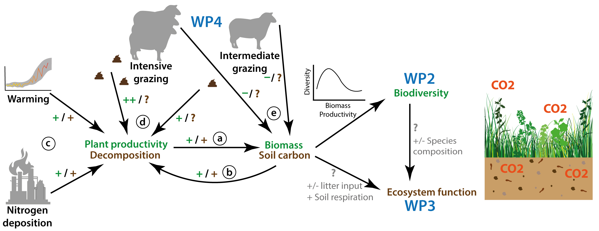
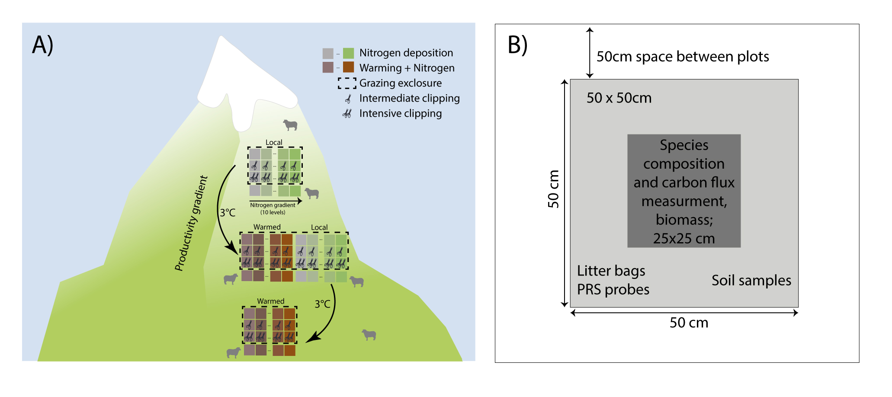
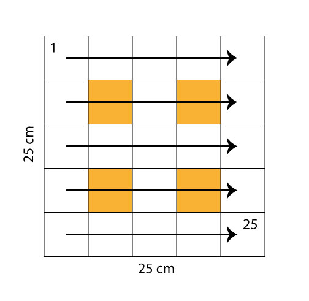

````{r InitialSettings, out.width='100%', include = FALSE}
knitr::opts_chunk$set(
  collapse = TRUE,
  comment = "#>",
  message = FALSE,
  warning = FALSE
)
library("tidyverse")
library("lubridate")
library("readxl")
library("tibble")
library("dataDownloader")
library("vegan")
#library("ggvegan")
library("patchwork")


theme_set(theme_bw(base_size = 12))

# {r, include=FALSE}
# source("R/C-Flux/description.R", local = knitr::knit_global())
#sys.source("data_dictionnary.R", envir = knitr::knit_global())


```

This is the git repository for the data paper:
Halbritter et al. (not written yet). THREE-D - Integrated assessment to aid mitigation of negative impacts by THREE global change Drivers on alpine biodiversity and ecosystem function.


# INTRODUCTION

Three of the most critical **global change drivers** are warming, nitrogen deposition, and grazing. All of these can have complex effects on **biodiversity** and **ecosystem function**, and, especially for biodiversity, effects can often be negative. 
For plant communities, these impacts operate through many of the same ecological pathways, involving changes in plant productivity and biomass as well as carbon cycling processes. 
In this project we argue that by combining these pathways into a single predictive framework we can both assess their complex interactions and, importantly, generate approaches to mitigate their combined effects on biodiversity and ecosystem function. 
In particular, we take advantage of two key aspects of grazing: (i) its impacts depend in a nonlinear and even non-monotonic way on plant productivity, and (ii) it is being amenable to manipulation at a local scale. This enables us to explore the circumstances under which grazing is itself a major ecological stressor vs. acting as an effective tool for reducing the ecological strains caused by climate warming and/or nitrogen deposition. 
To assess effects of three global change drivers and their impacts on ecosystem using a single framework, represents a significant advancement beyond the state-of-the-art. 
THREE-D is also innovative in that it goes beyond studying impacts of global change by exploring the potential of grazing as a management tool.


```{r proposal_figure, echo=FALSE, fig.cap= "Pathways of warmer climate, nitrogen deposition and grazing via productiviy and biomass on biodiverstiy and ecosystem function."}

```


The specific research questions are:
1)	How does grazing interact with climate warming and/or nitrogen deposition and affect biodiversity and ecosystem functioning in an alpine ecosystem?
2)	When and at what level does grazing mitigate the effects of these two global change drivers on biodiversity and ecosystem functioning?


## METHODS

### Research site

The study is conducted in three semi-natural grassland sites.
The sites are location on calcareous soil in Norway, and on mountain grey-brown soil in China (He, Liao, & Zhang, 2005).
The sites were chosen to fit within an elevational gradient with three temperature levels that differ in c. 400 m elevation, a temperature difference of approximately 2°C in summer temperature \@ref(fig:proposal_figure).
The sites correspond to the alpine, sub-alpine and boreal biogeographic zones in Norway and subalpine to alpine grasslands in China. Other factors such as grazing regime and history, bedrock, vegetation type and structure, slope and exposure were kept as constant as possible among the selected sites within each country.


```{r exp_design, echo=FALSE, fig.cap= "A) Experimental design at sites with low productivity (range centre) and high productivity (warm edge). The treatments are warming (red), nitrogen deposition (green), warming and nitrogen deposition (orange), and control (grey). These treatments are crossed with two clipping levels (intermediate and intensive) and natural grazing outside the grazing exclosure (stippled line). B) Example of a plot divided into data collection (species composition, carbon flux measures) and destructive harvesting (soil samples, litter bags, biomass harvesting) areas."}

```


We chose species rich grasslands, that were large enough to contain 80 50 x 50 cm plots and relatively flat to avoid contamination between the different nitrogen treatments and for convenience when measuring carbon fluxes.
A second criteria, was to have a high enough elevational gradient, to get an equal distance of 400 – 500 m difference in elevation between each of the sites.
The sites should also be relatively easy to access, because of transplanting large turfs.
Finally, we wanted other environmental factors to be as similar as possible among the sites, within each of the countries (i.e. grazing regime and history, bedrock, vegetation type and structure, slope and exposure).


### Experimental design

In each site, a large enough area for 40 – 80 plots was chosen.
Ten blocks, with 6 plots inside was marked with wooden poles in each corner.
Four aluminium pipes were hammered down into the soil in the outer corners of each 50 x 50 cm plot \@ref(fig:exp_design).
In addition, in the centre of the plot, we marked a 25 x 25 cm inner plots using the same method, ensuring the pipes to fit the corners of the standardized vegetation analysis frame (aluminium frame demarking a 25 x 25 cm inner area, with poles fixed in the corners that fit into the aluminium tubes used for plot demarcation in the field).
The upslope left corner tubes were marked with a colour-coded waterproof tape. Applying permanent plots for the treatments enable to find the exact same quadrate in the years to come.
The area where the fence was set up, was marked. Then 2 plot per block for the natural grazing treatment were chosen outside the fence.
These plots were < 10m from the adjacent block to have the same vegetation, but not too close to be affected by the fence.
Each plot was divided into non-destructive (25 x 25 cm; inner area) and destructive (outer area of the 50 x 50 cm plot) sampling areas.
Plant community composition, carbon fluxes (GPP, Reco), and biomass harvest was conducted in a non-destructive subplot The rest of the plot was used for destructive soil sampling (soil samples), nutrients (PRS probes), and litter decomposition and provided an opportunity for add-on projects during the THREE-D project (e.g. trait measurements).
Each plot was given a unique originPlotID starting at the upper left corner in block 1 and the high site. The numbering was continued to 160.
After transplanting each turf also received a unique destinationPlotID (a number from 1-200; see below). A realized site map with the actual location of each plot and block in all the sites was drawn and pictures of each site, block and plot was taken. The fence was set up.

The randomization of the treatments was done in two steps.
First, the 10 nitrogen levels were assigned randomly per block (i.e. block 1 received the same nitrogen level in each site).
We chose to randomize the nitrogen treatment at the block level to avoid contamination between the plots within the blocks. For sites with a slope > X° (name all the sites, where corrections were done), some of the nitrogen levels were switched to avoid contamination across the blocks.
If a block had a nitrogen treatment that was > 2 levels higher than the block downslope from the block, the nitrogen treatments were switched. This procedure was repeated until no nitrogen contamination was possible from upslope blocks. Second, the warming and grazing treatments were randomized within block.
The six plots within each block (inside the fence) were randomly assigned a warming and grazing treatment.
The two plots per block located outside the fence, were randomly assigned a warming treatment.
Each block contained 8 plots with one nitrogen level, ambient and warmed plots, combined with all 4 grazing levels.
The total number of plots was 160.


### Experimental treatments

All the treatments were applied to the whole 50 x 50 cm plot \@ref(fig:exp_design).

**Warming treatment** The warming treatment was conducted at the end of the growing season in 2019, by transplanting entire plant communities to the lower elevation (c. +2-3°C).
The upslope left-hand corner of each turf was marked with a toothpick that the turfs could be placed in the similar position relative to the slope and block orientation at the destination site.
We used a knife to cut the turfs to 50 x 50 cm and to a depth of c. 10 - 25 cm, unless the soil was shallower, as was the case for some of the alpine plots.
After excavation, the turfs were packed into a cardboard box and transported to their respective target sites within one day. The control plots were not excavated or moved. We did not have local transplants, to control for the transplanting effect, because this was tested in a previous project and the transplanting did not affect species composition in any of the system: SeedClim (Vandvik et al. 2020) and TransPlant, (Yang et al., 2018).

The turfs were fitted into the gaps created by excavating turfs at the destination site, except for the low site, where gaps had to be made. Each block received one plot of each treatment.
Turfs were placed in the block with the same numerical value (1 - 10) in the destination site as they originated from in the origin site.
Transplanted turfs were carefully planted into their destination plots (destinationPlotID) ensuring that the turf orientation was correct (using the toothpick marking the uphill left corner of each turf) that the soil surface was in plane with the surrounding vegetation, and that the edges of the excavated plot was in good contact with the edges of the gap created when the original turf was excavated from the plot.
If necessary, loose soil was carefully removed from the underside of the turf, or local soil was added to the gap or around the edges to achieve this.


**Nitrogen addition** In each plot we added slow dissolving fertilizer as pellets (YaraBela OPTI-NS 27-0-0 (4S)).
We used oxidised nitrogen (NO and N2O) formed mainly by combustion processes, which are the main sources of atmospheric nitrogen deposition in remote regions (i.e., away from intensive agriculture and other sources or reduced nitrogen).
The fertilizer was added once at the start and once in the middle of the growing season from 2020 - 2021 (or 2022). 
Each block reveived one of the seven nitrogen levels: 0, 0.5, 1, 5, 10, 50, 100, 150 kg N ha−1 yr−1.
Three of the blocks received 0 kg N ha−1 yr−1.
The natural nitrogen deposition differs in Norway (1.5-3.5 kg N -ha -y) and China (2-4 kg N -ha -y).
The critical load for changing species composition in these alpine grasslands is approximately 5-10 and 15 kg N ha−1 yr−1 in Norway and China, respectively.
We therefore wanted to have a range of nitrogen levels that were below and well above this critical load.
Although the natural annual deposition differs between Norway and China, the N addition was kept the same in both countries.

In 2020, the whole nitrogen treatment was applied at Vikesland at once (accident).

**Grazing treatment** The warming and nitrogen treatments were crossed with four grazing treatments. Grazing was simulated by clipping the vegetation manually with scissors.
The four treatments are: natural grazing (N; outside the fence), medium level of grazing (M; 2x clipp), intensive level of grazing (I; 4x clipp), and untreated control plots (C).
The intermediate clipping level reflects the natural grazing level outside the exclosure and should control for differences between grazing and clipping (i.e. clipping is not selective and will not add faeces and urine). The clipping treatment was conducted in 2020 - 2021 (2022).
The medium and intensive plots were clipped 2 or 4 times during the growing season.
For both treatments, the vegetation was clipped 2-3 cm above the ground.


**Field site maintenance** To simulate the natural grazing regime at each site, and to avoid accumulation of biomass, all biomass within the fence was removed at the end of each field season.
Note that the biomass removal, is not the same as the grazing treatment (see above) and biomass harvesting (see below).
The grazing treatment is applied to each plot (50 x 50 cm) in early and peak season, while the biomass harvesting occurs at the end of the field season (25 x 25cm plot).
The site maintenance has to be done after biomass harvesting.

Climate data was downloaded at start and the end of each field season.
 
 

### Data management
-      How to mark samples (project, year, date, responsible person, site, block, turfID)
-      All collected data is checked for errors and unrealistic values.
-      Plot all the data to check for errors and outliers
- turf maps for community data


### Data collection and measurements

**Plant species composition** Plant species composition was recorded annually at peak growing season, between 2019 and 2021.
Each 25 x 25 cm plots was divided into 25 subplots.
The recording started in the upper left corner, and went row by row, from left to the right.
In each subplot and for each species we recorded presence as sterile (1), dominant (D; covered more than 50% of the sub-plot), fertile (F; bud, flower, seeds), juvenile (J; not yet adult), or a seedling (S; cotyledons still attached; S).
The highest level was recorded, i.e. if there was a seedling and an adult, the adult was recorded.
So, the number of juveniles and seedlings were only consistently recorded if these were the only individuals present in the subplot of that species.
We also noted the presence of seedlings in each subplot, but they were not identified to species.
In addition, we recorded the percentage cover of vascular plants (only total), bryophytes, lichen, litter, bare ground and bare rock in each subplot.


```{r subplots, echo=FALSE, fig.cap= "Plot and sub-plot design. Orange plots indicate the subplot for the vegetation height measurements."}

```


In each 25 x 25 cm plot, the total percentage cover of each vascular plant species was estimated visually.
At 4 points in the grid (orange subplots in \@ref(fig:subplots)), average vegetation height and moss layer depth was measured using a ruler.
For each turf, date, originSite, originBlockID, originPlotID, weather, scribe and recorder and remarks were noted down.
Elevation, slope, exposure and soil depth (using metal pole at each corner) was recorded for each plot, including the plots at the low site. We took a picture from each plot.

For the Norwegian data, the nomenclature follows Lid & Lid(2010).
Each species of vascular plant was classified by functional type (graminoid, forb, woody) and biogeographic affinity based on information given in Lid & Lid(2010).
Specifically, species reported to be present in the Nemoral but lacking from the Low- Mid- or High Alpine are classified as “lowland”, species present in the Alpine but lacking from the Nemoral to South Boreal are classified as “alpine”, whereas all other species (i.e., species that span the gradient from Nemoral to Alpine zones) are classified as “generalist”. 
Write something about China…

*Problematic species*  add text here


**Measure Reflectance with Greenseeker** Measure reflectance (greeness) several times during the season in each plot from 2020-2022.
The greenseeker measures in an elliptical shape, and the light source and receiver should be located in the middle of the plot.
The green seeker is placed 60 cm above the plot and parallel to the ground, using a ruler.
Two measurements are done per plot perpendicular to each other to account for the elliptical shape.

The data was checked for unrealistic values.
Values, where the comma was forgotten, were divided by 100.


**Aboveground biomass**
Biomass will be harvested at the end of the growing season in 2021 from all plots, cut 2cm above the ground.
The biomass will be stored in the freezer until sorted into functional groups: grasses, sedges, forbs, legumes, shrubs, bryophytes, lichens and litter.
The biomass will be dried at 65°C for 72 hours and then weighed.

The biomass from the clipping treatments will be treated in the same way.
The biomass clipped in several rounds will be summed per plot for each growing season.


**Ecosystem fluxes**

Net ecosystem exchange (NEE) and ecosystem respiration (ER) were measured on the field while gross ecosystem production (GEP) is calculated as GEP = NEE - ER.
Carbon fluxes are measured with a closed loop chamber system connected to an infrared gaz analyser (INGRA; Li-840A, Li-cor).
The plexiglas chamber (25x25x40 cm) is connected to the INGRA with plastic tubes (inlet and outlet, 3m long and 4mm diameter each).
A filter prevents water droplets and small particules from entering the INGRA and an air pump ensures a flow of 1L/mn.
The chamber is equiped with a fan to mix the air, a thermocouple (Pt1000, Delta-T) to measure air temperature and a PAR sensor.
In 2020 the air temperature was measured with an iButton.
Airtightness is ensured by laying a heavy chain on the "skirt" of the chamber (a piece of tarp taped to the lower part of the chamber).
NEE is measured with a transparent chamber.
ER is measured with a dark chamber, in our case the transparent chamber was covered with a thick dark tarp.
The CO~2~ concentration was measured every seconds and logged in a datalogger (Squirrel 2010).
The chamber was put on the plot during two minutes for each measurements and then aired during one minute.
Since the logger was logging continuesly, the start and end time of each measurement was noted (it is necessary to precisely synchronise the logger clock with the watch used on the field and to regularly check it).
The function `match.flux()` is matching the time in the logger file with the plot being measured at that time (using the time recorded on the field).
It attributes the concentration of CO~2~ measured every seconds to the correct measurement.
A linear regression is fitted to every measurements and the slope is used to calculated the flux.

<!-- This is the code to keep in case we want to extract a pdf -->
<!-- $$ -->
<!--  \text{flux}=\text{slope}\times \frac{P\times V}{R\times T\times A} -->
<!-- $$ -->

<!-- - flux: the flux of CO~2~ at the surface of the plot ($mmol/m^2/h$) -->
<!-- - slope: slope of linear regression fitting the CO~2~ concentration versus time ($ppm^{-1}$) -->
<!-- - $P$: pressure, assumed 1 atm -->
<!-- - $V$: volume of the chamber and tubing ($L$) -->
<!-- - $R$: gas constant ($0.082057\ L*atm*K^{-1}*mol^{-1}$) -->
<!-- - $T$: chamber air temperature ($K$) -->
<!-- - $A$: area of chamber frame base ($m^2$) -->


Where:

- flux: the flux of CO~2~ at the surface of the plot (mmol/m^2^/h)
- slope: slope of linear regression fitting the CO~2~ concentration versus time (ppm^-1^)
- P: pressure, assumed 1 atm
- V: volume of the chamber and tubing (L)
- R: gas constant (0.082057 L\*atm\*K^-1^\*mol^-1^)
- T: chamber air temperature (K)
- A: area of chamber frame base (m^2^)


The function `flux.calc` calculates the flux with default values for Three-D setup.

<!-- Fluxes with a non significant slope (>0.05) were removed. -->

<!-- cleaning -->
<!-- data description -->
<!-- Make a new table in an R script and call it here. Use the col names from the flux data set and take exemple on the China data paper (https://www.nature.com/articles/s41597-020-0529-0/tables/4?proof=t) -->

<!-- # ```{r, include=FALSE, code=xfun::read_utf8("description.R")} -->
<!-- # ``` -->
```{r cflux-data-dic, echo=FALSE}
#knitr::kable(variables.cflux, format="html")
```

<!-- light response curves -->


**CN stocks, pH, soil organic matter** Collecting soil samples: In sommer 2019, two soil samples were collected from each blocks, but outside the plots.
The soil samples of 5 cm diameter and 4 cm deep were taken. One sample was taken from the upper organic layer, and another one from the lower part of the soil.

The soil samples were stored in the fridge (4°C) until further use.

One soils sample was dried to measure pH, soil organic matter and CN stocks. The soil was dried at 60°C for 24h and sieved with a 2mm sieve. Stones and larger roots were removed.

One soil sample was kept in the fridge to measure bulk density and water holding capacity.


**Soil pH measurement** The pH was measured in a soil water solution.
The soil:water ratio depends on the amount of organic matter in the soil with a ratio of soil to water of 1:2.5 to 1:5 by weight for mineral soil.
The method described here is based upon that employed by the Soil Survey of England and Wales (Avery & Bascomb, 1974) and by the Countryside Survey (Emmett et al., 2010).

Calibration: Calibrate the pH meter in buffer solutions. Check pH 4, 7 and 9 buffer calibrations regularly within a sample batch, every 10 samples.
If either buffer calibration is more than 0.02 of a pH unit from the correct value, repeat the calibration.

Weigh 10 g of fresh field-moist soil into a 50 ml plastic pH beaker.
Add 50 ml of deionised water and stir the suspension thoroughly.
Allow it to stand for 30 minutes, stirring occasionally. Measure soil pH electrometrically using the calibrated pH meter.


**Soil organic matter** (Hidden Cost protocol)
To measure soil organic matter (SOM), we used the method described by Ball(1964).
10 g of fresh soil was weight into a cup. The soil was then dried for 16h at 105°C.
The soil was weighed. Then the sample was placed in a furnace overnight at 375 °C.
The soil was weighed again. SOM is defined as the difference in the weight between the dried and burned soil.

- soil depth measured every 5m along the Gentry-plot lines and take a picture
- soil cores were taken at 3 locations per transect line (10, 30 and 50m)
- Soil cores were separated into different layers and litter in different bags (zip-loc)
- Soil samples were kept in zip-lock-bags in the fridge at 4°C degrees until further processing
- Soil samples were transferred to aluminum trays dried at 105°C for 24h
- Dry weight of the entire sample was recorded
- The dried sample is transferred to a porcelain mortar and carefully crushed so you can pick out bigger stones, roots and maybe mosses (stones and mosses are kept marked as “other”). 
Roots for the entire sample are weighed separately and collected in a bag marked “roots”
- A subsample (or if the sample is very small, the whole sample) was used to determine organic matter content using Loss On Ignition method. 
The subsample was transferred to porcelain beaker and weighed and then burned at 550°C for 6h
- The weight after burning was recorded after the samples had cooled down in the desiccator for at least half an hour.
- The sample was burned a second time at 950°C for 1h and weight recorded after cooling period in the desiccator
 

**Climate data** Temperature was measured continuously (every 15 min) at three heights (15 cm, at ground level, and 5 cm below ground) and soil moisture was measured continuously 5 cm below ground using Tomst TM4 loggers (Wild et al., 2019).
A Tomst logger was placed in all 6 plots inside the fence in the blocks receiving nitrogen treatments: N1, N2, N4,  N5, N6, N9, N10 (the plots receiving a climate logger will be indicated on the site map). The logger was place in the corner of the 50x50 cm plot.
The climate loggers were put on the plots between July and September 2019.
In total there are 72 climate loggers.
The Three-D_ClimateLogger_meta_2019.xlsx file has information when which logger was put out.

Precipitation data was extracted from nearby climate stations or interpolated from met.no data or similar.

