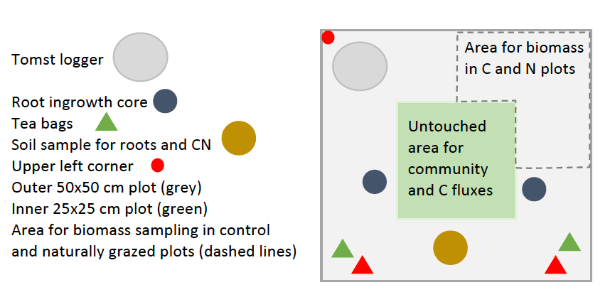

```{r setup, out.width='100%', include = FALSE}
knitr::opts_chunk$set(collapse = TRUE, 
                      comment = "#>", 
                      message = FALSE, 
                      warning = FALSE, 
                      eval = TRUE,
                      echo=FALSE)
library(tidyverse)
library(lubridate)
library(readxl)
library(tibble)
library(dataDownloader)
library(vegan)
#library("ggvegan")
library(patchwork)
library(kableExtra)


theme_set(theme_bw(base_size = 12))


# Data
source("R/Rgathering/DownloadCleanData.R")
source("R/Soil/ReadInSoilData.R")
source("R/Rgathering/Data_dic.R")


```

This is the git repository for the THREE-D project and the associate data paper:
Halbritter et al. (not written yet). THREE-D - Integrated assessment to aid mitigation of negative impacts by THREE global change Drivers on alpine biodiversity and ecosystem function.


# INTRODUCTION

Three of the most critical **global change drivers** are warming, nitrogen deposition, and grazing. All of these can have complex effects on **biodiversity** and **ecosystem function**, and, especially for biodiversity, effects can often be negative. 
For plant communities, these impacts operate through many of the same ecological pathways, involving changes in plant productivity and biomass as well as carbon cycling processes.

In this project we argue that by combining these pathways into a single predictive framework we can both assess their complex interactions and, importantly, generate approaches to mitigate their combined effects on biodiversity and ecosystem function. 
In particular, we take advantage of two key aspects of grazing: (i) its impacts depend in a non-linear and even non-monotonic way on plant productivity, and (ii) it is being amenable to manipulation at a local scale.

This enables us to explore the circumstances under which grazing is itself a major ecological stressor vs. acting as an effective tool for reducing the ecological strains caused by climate warming and/or nitrogen deposition. 
To assess effects of three global change drivers and their impacts on ecosystem using a single framework, represents a significant advancement beyond the state-of-the-art.


```{r proposal-figure, fig.cap= "Pathways of warmer climate, nitrogen deposition and grazing via productiviy and biomass on biodiverstiy and ecosystem function."}
knitr::include_graphics('Pics/ProposalFigure_small.jpg')
```


The specific research questions of the THREE-D project are:

1)	How does grazing interact with climate warming and/or nitrogen deposition and affect biodiversity and ecosystem functioning in an alpine ecosystem?

2)	When and at what level does grazing mitigate the effects of these two global change drivers on biodiversity and ecosystem functioning?


# METHODS

## Research site

The study is conducted in three semi-natural grassland sites in western Norway and the eastern edge of the Himalaya in Gongga Mountain, Sichuan in China.
The sites are location on calcareous soil (loamy sand) in Norway, and on mountain grey-brown soil in China.
The sites were chosen to fit within an elevational gradient with three temperature levels that differ in c. 400 m elevation, a temperature difference of approximately 3°C in summer temperature (Figure(\@ref(fig:proposal-figure)).
The sites correspond to boreal, sub-alpine and alpine biogeographic zones in Norway and sub-alpine to alpine zones in China. Other factors such as history, bedrock, vegetation type and structure, slope and exposure were kept as constant as possible among the selected sites within each country.

The sites in Norway are grazed by sheep and goats, while the sites in China are grazed by yak, horses, cows and sheep.


```{r exp-design, fig.cap= "A) The experiment are set up along an elevational gradient that represents a productivity gradient. The experimental treatments are warming (brown), a grdient of nitrogen addition (grey to green) and their combination. These treatments are crossed with four grazing treatment: control (no clipping), intermediate and intensive clipping, and natural grazing outside the grazing exclosure. B) Example of a plot divided into non destructive (inner square) and and destructive sampling area (outer square)."}

knitr::include_graphics('Pics/ExperimentalDesign.jpg')
```


```{r site-table}

kbl(siteMetaData_pretty, caption = "Site level information including site name, elevaiton, coordinates, bulk density (g/cm), soil texture (percentage sand, silt and clay), soil organic matter (SOM), carbon content, carbon and nitrogen stocks and pH. Numeric data is reported as mean ± SE")
```


We chose species rich grasslands, that were large enough to contain 80 50 x 50 cm plots and relatively flat to avoid contamination between the different nitrogen treatments and for convenience when measuring carbon fluxes.
A second criteria, was to have a high enough elevational gradient, to get an equal distance of c. 400 m difference in elevation between each of the sites.
The sites also needed to be relatively easy to access, because large vegetation turfs were transplanted.
Finally, we wanted other environmental factors to be as similar as possible among the sites, within each of the countries (i.e. grazing regime and history, bedrock, vegetation type and structure, slope and exposure).


```{r site-figure, fig.cap="Soil characteristics for all three sites at the top and bottom soil layer."}

soil <- read_delim(file = "data_cleaned/soil/THREE-D_Soil_2019-2020.csv", delim = ",")
meta <- read_csv(file ="data_cleaned/soil/THREE-D_PlotLevel_Depth_2019.csv")

soil %>% 
  left_join(meta %>% 
              mutate(destBlockID = as.character(destBlockID)) %>% 
              group_by(destSiteID, destBlockID, year) %>% 
              summarise(soil_depth_cm = mean(soil_depth_cm)), 
            by = c("destSiteID", "destBlockID", "year")) %>%
  pivot_longer(cols = c(pH, bulk_density_g_cm, soil_organic_matter, soil_depth_cm, C_percent, N_percent), 
               names_to = "variable", values_to = "value") %>% 
  mutate(variable = factor(variable, levels = c("soil_depth_cm", "bulk_density_g_cm", "pH", "soil_organic_matter", "C_percent", "N_percent")),
         Site = recode(destSiteID, Lia = "High alpine", Joa = "Alpine", Vik = "Lowland"),
         Site = factor(Site, levels = c("High alpine", "Alpine", "Lowland")),
         layer = factor(layer, levels = c("Top", "Bottom")),
         value = if_else(variable == "soil_depth_cm" & layer == "Bottom", NA_real_, value)) %>% 
  filter(!is.na(value)) %>% 
  ggplot(aes(x = Site, y = value, fill = layer)) +
  geom_boxplot() +
  scale_fill_manual(name = "", values = c("rosybrown1", "rosybrown")) +
  labs(x = "", y = "") +
  facet_wrap(~ variable, scales = "free_y") +
  theme_minimal() +
  theme(legend.position = "top")

```


## Experimental design

At each site, ten blocks, with 8 plots were marked in each corner.
Six plots were chosen relatively close to each other (inside the fence) and two plots were chosen further away (outside fence). The plots outside the fence were < 10 m from the adjacent block to have the same vegetation, but not too close to be affected by the fence.
Four aluminium pipes were hammered down into the soil in the outer corners of each 50 x 50 cm plot (Figure \@ref(fig:exp-design)) to permanently mark each plot for revisitation.
The centre 25 x 25 cm of each plot was also marked using the same method, marking the corners for the standardized vegetation analysis frame.
The upslope left corner tubes of the inner and outer square were marked with a colour-coded waterproof tape to ensure the same orientation of the plots. 
A fence was set up around the plots, leaving 2 plots per block outside the fence.
The fence was set up in autumn 2019 in China and in spring 2020 in Norway before the grazing animals arrived at the sites.

Each plot was given a unique originPlotID starting at the upper left corner in block 1 and the highest site.
The numbering was continued to 160.
After transplanting, each turf also received a unique destinationPlotID (a number from 1-200; see below).
A realized site map with the actual location of each plot and block in all the sites was drawn and pictures of each site, block and plot was taken.

Each plot received a combination of each treatment randomly (warming, nitrogen addition and grazing, see below).
The randomization of the treatments was done in two steps.
First, the 10 nitrogen levels were assigned randomly per block (i.e. block 1 received the same nitrogen level in each site).
We chose to randomize the nitrogen treatment at the block level to avoid nitrogen contamination between the plots within the blocks.
If a block had a nitrogen treatment that was > 2 levels higher than the block downslope from the block, the nitrogen treatments were switched.
This procedure was repeated until no nitrogen contamination was possible from upslope blocks.

Second, the warming and grazing treatments were randomized within block.
The six plots within each block (inside the fence) were randomly assigned a warming and grazing treatment.
The two plots per block located outside the fence, were randomly assigned a warming treatment.


## Experimental treatments

All the treatments were applied to the whole 50 x 50 cm plot (Figure 2B).

### Warming treatment
The warming treatment was conducted at the end of the growing season in 2019, by transplanting entire plant communities to lower elevation (c. +3°C).
The upslope left-hand corner of each turf was marked with a toothpick that the turfs could be placed in the similar position relative to the slope and block orientation at the destination site.
We used a knife to cut the turfs to 50 x 50 cm and to a depth of c. 10 - 25 cm, unless the soil was shallower, as was the case for some of the alpine plots.
After excavation, the turfs were packed into a cardboard box and transported to their respective target sites within one day. The control plots were not excavated or moved. 
We did not have local transplants, to control for the transplanting effect, because this was tested in a previous project and the transplanting did not affect species composition in Norway [@Vandvik2020-hu] or China [@Yang2018-uq].

The turfs were fitted into the gaps created by excavating turfs at the destination site, except for the low site, where gaps had to be made. Each block received one plot of each treatment.
Turfs were placed in the block with the same numerical value (1 - 10) and nitrogen level in the destination site as they originated from in the origin site.
Transplanted turfs were carefully planted into their destination plots (destinationPlotID) ensuring that the turf orientation was correct (using the toothpick marking the uphill left corner of each turf) and that the soil surface was in plane with the surrounding vegetation, and that the edges of the excavated plot was in good contact with the edges of the gap created when the original turf was excavated from the plot.
If necessary, loose soil was carefully removed from the underside of the turf, or local soil was added to the gap or around the edges to achieve this.


### Nitrogen addition
In each plot we added slow dissolving fertilizer as pellets (YaraBela OPTI-NS 27-0-0 (4S)).
We used oxidised nitrogen (NO and N~2~O) formed mainly by combustion processes, which are the main sources of atmospheric nitrogen deposition in remote regions (i.e., away from intensive agriculture and other sources or reduced nitrogen).
The fertilizer was added once at the start and once in the middle of the growing season from 2020 - 2021 (2022). 
Each block received one of the seven nitrogen levels: 0, 0.5, 1, 5, 10, 50, 100, 150 kg N ha^−1^ yr^−1^.
Three of the blocks were controls and received 0 kg N ha^−1^ yr^−1^.

The natural nitrogen deposition differs in Norway (1.5-3.5 kg N ha^−1^ yr^−1^) and China (2-4 kg N ha^−1^ yr^−1^).
The critical load for changing species composition in these alpine grasslands is approximately 5-10 and 15 kg N ha^−1^ yr^−1^ in Norway and China, respectively.
We therefore wanted to have a range of nitrogen levels that were below and well above this critical load.
Although the natural annual deposition differs between Norway and China, the Nitrogen addition was kept the same in both countries.

In 2020, the nitrogen treatment was only applied once at Vikesland (lowest site in Norway) due to an accident, however this did not change the amount of nitrogen applied, only the timing.

### Grazing treatment
The warming and nitrogen treatments were crossed with four grazing treatments.
Grazing was simulated by clipping the vegetation manually with scissors 2-3 cm above the ground.
The four grazing treatments were natural grazing (N; outside the fence), medium level of grazing (M; 2x clipp), intensive level of grazing (I; 4x clipp), and untreated control plots (C).
The intermediate clipping level reflects the natural grazing level outside the exclosure and should control for differences between grazing and clipping (i.e. clipping is not selective and will not add faeces and urine).
The medium and intensive plots were clipped 2 or 4 times during the growing season.
The clipping treatment was conducted in 2020 - 2021 (2022).

The realized cutting in 2020 is shown in the table below.
In 2020, the intensive grazing level at the higest site in Norway (Liahovden) only received 3 cuts, because the growing season was short due to snow and a cold spring.
The vegetation did not grow very much at the end of the season and an additional cut would not have removed anymore biomass.
The intensive grazed plots received 4 cuts (1-4), except Lia (1,2,4), and the intermediate grazed plots received 2 cuts (1,4).
Cut 3 for Lia does not exist in 2020.

In 2021 (and 2022), we did not clip Carex species until the third cut, because they are difficult to identify and often the tips of the leaves are needed for identification.


```{r clipping-table}

tibble(Cut = rep(1:4, 2),
       Year = c(rep(2020, 4), rep(2021, 4)),
       Vikesland = c("3 June", "24 June", "12-13 August", "6,7,11 September", "29 May", "7-8 July", "2-3 August", "3 September"),
       Joasete = c("3-4 July", "17 July", "10-12 August", "8-9 September", "30 May / 15 June", "5,6,8,9 July", "4-6,9,10 August", "2 September"),
       Liahovden = c("15 July", "11 August", "NA", "10 September", "16 June", "7-8 July", "11 August", "1 September")) %>% 
  kbl(caption = "The timing of the cutting at each site in 2020 - 2021.")
```


### Field site maintenance

To simulate the natural grazing regime at each site, and to avoid accumulation of biomass, all biomass within the fence was removed at the end of each field season.
Note that the biomass removal, is not the same as the grazing treatment (see above) and biomass harvesting (see below).
The grazing treatment is applied to each plot (50 x 50 cm) in early and peak season, while the biomass harvesting occurs at the end of the last field season (25 x 25cm plot).
The site maintenance has to be done after biomass harvesting.

Climate data was downloaded at start and the end of each field season.
 
 

## Data management

### Location of data and supporting information 

Project meta-information, data set overview and metadata for each dataset are in this readme file, available on GitHub: https://github.com/audhalbritter/Three-D

The Norwegian data from the project is stored and available on OSF: https://osf.io/pk4bg/

All R code for the analyses from the Norwegian project is on GitHub: https://github.com/audhalbritter/Three-D

Links to information, data, popular science and publications are on the THREE-D webpage:
http://www.audhalbritter.com/three-d/ and https://betweenthefjords.w.uib.no/three-d/


### Download clean data

To download the clean data from OSF use the dataDownloader package.
This is how to install and load the package.


```{r downloader-function, echo= TRUE, eval=FALSE}

devtools::install_github("Between-the-Fjords/dataDownloader")
library("dataDownloader")

```


Here is an example for how to download the biomass data:

```{r downloader-biomass, echo=TRUE, eval=FALSE}
get_file(node = "pk4bg",
         file = "THREE-D_Biomass_2020.csv",
         path = "data_cleaned/vegetation",
         remote_path = "Vegetation")

```

If you want to download other datasets you can use the `DownloadCleanData.R` script on GitHub:
https://github.com/audhalbritter/Three-D/blob/master/R/Rgathering/DownloadCleanData.R

For an overview of all available datasets see Table (\@ref(tab:data-sets).


### Naming conventions used for the data

| Data or file  | Description of naming convention  |
|:---|:---|
| Data files  | Project_Experiment_Dataset_Year.extension  |
| Readme files  | Project_Experiment_Dataset_Year.Rmd  |
| species  | Vascular plant taxon names follow for Norway Lid & Lid(Lid J & Lid, 2010) and for China e-flora of China? The full taxa is written using genus and species with a blank. |
| Country  | Norway or China  |
| Project  | THREE-D  |
| Experiment  | Grazing exclosure  |
| Datasets  | Project_Experiment_Dataset_Year, THREE-D_plant_community_2019, THREE-D_carbon_flux_2021  |
| EN_predictor  | Environmental data are generally used for more than one experiment, and are therefore coded as [EN]  |
| warming  | ambient (A), warm (W)  |
| Nlevel  | 1-10, where N1 is 0 kg ha^-1^ y^-1^ and N10 is 150 kg ha^-1^ y^-1^|
| grazing  | Medium grazing (M), intensive grazing (I), natural grazing (N), control/no grazing (C)  |
| origSiteID  | Name of the origin site; Norway: Joasete (Joa), Liahovden (Lia); China: H (High) and M (Medium) |
| destSiteID  | Name of the destination site; Norway: Vikesland (Vik), Joasete (Joa), Liahovden (Lia); China: H (High), M (Medium) and L (Low) |
| origBlockID  | 1-10  |
| destBlockID  | 1-10 (is always the same as origin block ID, because turfs are transplanted within block). |
| origPlotID  | 1-160 (plots only in high and middle site) |
| destPlotID  | 1-200 (plots all 3 sites) |
| turfID | originPlotID-3 treatments (warming, nitrogen level, and grazing)-destPlotID e.g. 1-A5C-1 or 2-W5M-125|
| responses  | response, e.g. cover, biomass, Reco, etc. |


### Data handling and curation

All collected data was checked for errors and unrealistic values using vizualization.
Errors were fixed or deleted if there was a valid reason.

The community data was checked using turf maps that show change in species cover over time (see below).


## Data collection and measurements

The following datasets were collected and are available on OSF (https://osf.io/pk4bg/).

```{r data-sets}

tibble(Variable = c("Elevation", "Coordinates, slope and aspect", 
                    "Cover", "Presence", "Functional group cover", "Vegetation height", 
                    "Aboveground biomass", "Belowground biomass", "Aboveground productivity", "Belowground productivity", 
                    "Reflectance", 
                    "Ecosystem fluxes", "Soil respiration",
                    "Soil depth", "Soil texture", "Bulk density",
                    "Soil pH", "Soil organic matter", "Soil C and N stocks", "Soil nutrients",
                    "Decomposition",
                    "Air, ground and soil temperature", "Soil moisture", "Gridded climate"),
       Period = c("2019", "2019", "2019-2021", "2019-2021", "2019-2021", "2019-2021", "2020-2021", "2021", "2021", "2021", "2020-2021", "2020-2021", "2021", rep("2019", 5), "2019-2020", "2021", "2021", "2019-2020", "2019-2020", "2009-2020"),
       Level = c("site", "plot", "plot", "subplot", rep("plot", 10), "site", "plot", "site", "block", "site", "site", "plot", "plot", "plot", "site"),
       File = c("THREE-D_metaSite.csv", "THREE-D_metaSite.csv", 
                "THREE-D_Cover_2019_2020.csv", "THREE-D_CommunitySubplot_2019_2020.csv", "THREE-D_CommunityStructure_2019_2020.csv", "THREE-D_Height_2019_2020.csv", 
                "THREE-D_Biomass_2020.csv", "NA", "NA", "NA", 
                "THREE-D_Reflectance_2020.csv ", 
                "Three-D_c-flux_2020.csv", "NA",
                "THREE-D_PlotLevel_Depth_2019.csv", rep("THREE-D_Soil_2019-2020.cs", 5),
                "NA",
                "NA",
                "NA", "NA", "THREE_D_Gridded_DailyClimate_2009-2019.csv")
       ) %>% 
  kbl(caption = "All avalble datasets with name, time period of data collection, level at which they were collected and file name on OSF.") %>% 
  pack_rows("Site", 1, 2) %>% 
  pack_rows("Vegetation", 3, 11) %>% 
  pack_rows("C-flux", 12, 13) %>% 
  pack_rows("Soil", 14, 21) %>% 
  pack_rows("Climate", 22, 24)
```


### Meta data

To create the meta data (i.e. site, block, plot, turfID, treatments) use this script on GitHub:
https://github.com/audhalbritter/Three-D/blob/master/R/Rgathering/create%20meta%20data.R

The xlsx file created on line 82 (unhashing needed) `metaTurfID` contains all necessary meta data.


### Site and plot level data
Elevation at each site was assessed using a GPS.
The slope, exposure was measured in each plot using a compass and a clinometer.
Soil depth was measured sticking a metal pole in each corner of the plot and then measuring how deep it entered the soil.


### Plant species composition (presence, cover and vegetation height)
**Presence:** Plant species composition was recorded annually at peak growing season, in 2019 and 2021.
To be able to identify all species, we chose a time in between two clipping events (grazing treatment), to ensure that most species were fully grown and the leaves were not clipped.
In 2020, not all the plots were surveyed due to fieldwork restrictions related to the Covid-19 pandemic (see below).
Each 25 x 25 cm plots was divided into 25 subplots (Figure \@ref(fig:subplots)).
We recorded each plot from the upper left corner, and went row by row, from left to the right (see black arrows in Figure \@ref(fig:subplots)).
In each subplot and for each species we recorded presence as sterile (1), dominant (D; covered more than 50% of the sub-plot), fertile (F; bud, flower, seeds), juvenile (J; not yet adult), or a seedling (S; cotyledons still attached; S).
For each species, the highest level was recorded, i.e. if there was a seedling and an adult, the adult was recorded.
The number of juveniles and seedlings were only consistently recorded if these were the only individuals present in the subplot of that species.
We also noted the presence of seedlings in each subplot, but often they were not identified to species (unknown seedlings).
In addition, we recorded the cover of each species in each plot (numeric value between 1 and 100).


In 2020, species composition was recorded fully only for the control and warmed plots receiving no nitrogen (block 1, 4, and 10).
For the rest of the plots, only percentage cover by functional group was recorded.


```{r subplots, fig.cap= "Plot and sub-plot design. Orange plots indicate the subplot for the vegetation height measurements."}
knitr::include_graphics('Pics/Subblots.jpg')
```


**Cover:** In each 25 x 25 cm plot, the total percentage cover of each vascular plant species was estimated visually.
We also recorded the percentage cover of vascular plants (only total), bryophytes, lichen, litter, bare ground, bare rock and poop in each subplot.

**Height:** At four points in the grid (orange subplots in Figure \@ref(fig:subplots)), average vegetation height and moss layer depth was measured using a ruler.

For each turf, date, originSite, originBlockID, originPlotID, scribe and recorder and remarks were noted down.
A picture was taken from each plot.

For the Norwegian data, the nomenclature follows Lid & Lid [-@Lid2010-ck].
Each species of vascular plant was classified by functional type (graminoid, forb, woody) and biogeographic affinity based on information given in Lid & Lid [-@Lid2010-ck].
Specifically, species reported to be present in the Nemoral but lacking from the Low- Mid- or High Alpine are classified as “lowland”, species present in the Alpine but lacking from the Nemoral to South Boreal are classified as “alpine”, whereas all other species (i.e., species that span the gradient from Nemoral to Alpine zones) are classified as “generalist”. 


**Data handling:** After each field season the data was checked vizually by plotting the cover of each species per plot over time using the `turfmapper` package.
This allows to compare change in species composition over time and check for misidentifications and data entry errors.

Species that only occured in one year, but showed similar occurence patterns in the plot for another species in the previous/following year(s) was checked in the pictures taken from the plots in each year and was also checked in the datasheets.
Obvious wrong entries and or species names were then fixed in the data.

Species that were not certain in their identification was named *Genus species cf*.

In 2019, two recorders often mixed *Taraxacum sp* and *Leotodon autumnalis*.
These issues were resolved when the mistakes were obvious from the turfmaps and the pictures taken of each plot in each year.

The identification of *Antennaria alpina* and *Antennaria dioica* as well as *Luzula spicata* and *Luzula multiflora* are difficult and only certain when the plants are flowering.
These species were all changed to *Antennaria sp* and *Luzula sp* if the identification was uncertain.
If the plants were flowering in one year or the recorded made a comment about certainty of identifying a species, the species in this subplot and sometimes close subplots was renamed.

Identification of Carex species was difficult, especially in the plots that were clipped (leaf tips are often important for identification).

Other potential problems occured with (need to figure out if they are real problems and how to fix those)
- Festuca ovina and rubra and maybe Avenella flexuosa
- Poa alpina and Poa pratensis

The code for fixing the community data are: `subplot_problems.R` and `comm_corrections.R`.


### Aboveground biomass

There are two types of biomass measurements:


#### Biomass from grazing treatment

Biomass was clipped and harvested as a grazing treatment in the plots that received intermediate or intensive grazing (see section on treatments above).
The biomass was clipped 2-3 cm above the ground in several rounds during each growing season (2020-2021, 2022?).
The biomass was sorted into functional groups: grasses, sedges, forbs, legumes, shrubs, bryophytes, lichens and litter.
The biomass was then dried at 65°C for 72 hours and weighed.


#### Biomass harvest

Biomass was harvested at peak growing season in 2021 from all plots.
It was not possible to harvest biomass in the whole 50 x 50 cm plot, because we needed the centre of the control and naturally grazed plots to be untouched.
Therefore, biomass was harvested in one corner of the outer square of each plot (see Figure Figure \@ref(fig:plot-harvest)) for the control and naturally grazed plots.
The biomass was sorted into functional groups: grasses, sedges, forbs, legumes, shrubs, bryophytes, lichens and litter.
The biomass was then dried at 65°C for 72 hours and weighed.

For the medium and intensive grazing treatment the plots were harvested in two separate steps.
The same area as was clipped for the other treatments was clipped, sorted and weighed separately.
This was done to check if cutting a smaller area of the plot would change ratio for biomass for each functional group or if the plots were homogeneous enough.
The biomass of these plots was treated in the same way as above.


*Data handling:* The data was visually checked for unrealistic values, which were corrected or removed if there was a valid reason.


```{r plot-harvest, fig.cap= "Design for plot harvesting in 2021."}

```

### Belowground biomass
Will be collected in 2022.


### Belowground productivity

Root ingrowth cores ... (Helene)


### Reflectance
Reflectance (greeness of vegetation) was measured several (add range!) times during the season in each plot from 2020-2021 (2022).
The greenseeker measures an elliptical shape, and the light source and receiver should be located in the middle of the plot.
The green seeker was placed 60 cm above the plot and parallel to the ground, using a ruler.
Two measurements were done per plot perpendicular to each other to account for the elliptical shape.

*Data handling:* The data was visually checked for unrealistic values, which were corrected or removed if there was a valid reason (e.g. shade or snow on the plot).
Unrealistic values, where the comma was forgotten, were divided by 100.


### Decomposition
Tea bag index... (Helene)


### Ecosystem fluxes

Carbon fluxes are measured with a closed loop chamber system connected to an infrared gaz analyser (INGRA; Li-840A, Li-cor).
The plexiglas chamber (25 x 25 x 40 cm) is connected to the INGRA with plastic tubes (inlet and outlet, 3 m long and 4 mm diameter each).
A filter prevents water droplets and small particles from entering the INGRA and an air pump ensures a flow of 1 L/mn.
The chamber is equipped with a fan to mix the air, a thermocouple (Pt1000, Delta-T) to measure air temperature and a PAR sensor.
In 2020 the air temperature was measured with an iButton.
Airtightness is ensured by laying a heavy chain on the "skirt" of the chamber (a piece of tarp taped to the lower part of the chamber).

**Net ecosystem exchange** (NEE) and **ecosystem respiration** (ER) were measured on the field while gross ecosystem production (GEP) is calculated as GEP = NEE - ER.
**NEE** is measured with a transparent chamber.
**ER** is measured with a dark chamber, in our case the transparent chamber was covered with a thick dark tarp.

The CO~2~ concentration was measured every seconds and logged in a datalogger (Squirrel 2010).
The chamber was put on the plot during two minutes for each measurements and then aired during one minute.
Since the logger was logging continuously, the start and end time of each measurement was noted (it is necessary to precisely synchronise the logger clock with the watch used on the field and to regularly check it).

The function `match.flux()` is matching the time in the logger file with the plot being measured at that time (using the time recorded on the field).
It attributes the concentration of CO~2~ measured every seconds to the correct measurement.
A linear regression is fitted to every measurements and the slope is used to calculated the flux:


<!-- This is the code to keep in case we want to extract a pdf -->
<!-- $$ -->
<!--  \text{flux}=\text{slope}\times \frac{P\times V}{R\times T\times A} -->
<!-- $$ -->

<!-- - flux: the flux of CO~2~ at the surface of the plot ($mmol/m^2/h$) -->
<!-- - slope: slope of linear regression fitting the CO~2~ concentration versus time ($ppm^{-1}$) -->
<!-- - $P$: pressure, assumed 1 atm -->
<!-- - $V$: volume of the chamber and tubing ($L$) -->
<!-- - $R$: gas constant ($0.082057\ L*atm*K^{-1}*mol^{-1}$) -->
<!-- - $T$: chamber air temperature ($K$) -->
<!-- - $A$: area of chamber frame base ($m^2$) -->


where
flux: the flux of CO~2~ at the surface of the plot (mmol/m^2^/h)
slope: slope of linear regression fitting the CO~2~ concentration versus time (ppm^-1^)
P: pressure, assumed 1 atm
V: volume of the chamber and tubing (L)
R: gas constant (0.082057 L\*atm\*K^-1^\*mol^-1^)
T: chamber air temperature (K)
A: area of chamber frame base (m^2^)


The function `flux.calc` calculates the flux with default values for Three-D setup.

<!-- Fluxes with a non significant slope (>0.05) were removed. -->


<!-- data cleaning -->
<!-- The first 30 seconds of each measurements were removed because that is when the chamber is being manipulated, affecting the measurement quality. -->
<!-- Then the time window for each flux has been adjusted if necessary. -->
<!-- The end of the flux is cut out if it is reaching a plateau (because a linear regression is used for the calculations). -->
<!-- In case a clear peak is appearing in the middle of the flux, it was removed as well. -->
<!-- Because of moisture in the tubes, some bubble of CO~2~ can get stuck and be released at once. -->
<!-- This is appearing as a peak in CO~2~ concentration. -->

<!-- Only a central time window of 60 seconds is kept, meaning that the first and last 30 seconds of the flux are discarded. -->
<!-- It is mostly at the beginning and the end of the measurement that the chamber is being disturbed by the manipulation. -->
<!-- Fluxes with a p-value <= 0.05 and R squared >= 0.7 are kept. -->
<!-- But this is discarding fluxes close to 0, which tend to have a lot of variation (noise). -->
<!-- For that reason, fluxes with non significant p-value and R squared <= 0.2 are also kept. -->
<!-- data description -->
<!-- Make a new table in an R script and call it here. Use the col names from the flux data set and take exemple on the China data paper (https://www.nature.com/articles/s41597-020-0529-0/tables/4?proof=t) -->


### Light response curves

Needs to be described.


### Soil

#### Soil sampling for CN stocks, pH, soil organic matter and soil texture

In summer 2019, two soil samples were collected from each block, but outside the plots to avoid destructive sampling.
The soil samples were 5 cm in diameter and 4 - 8 cm deep.
The soil samples were taken as depth as possible, and each soil were divided into the upper organic layer, and if possible the lower mineral soil.
These samples were taken to collect data on pH, CN stocks, soil organic matter and soil texture.

In 2020, 5 soil samples per site (in between the blocks) were taken using the same method.
These samples were used to collect data on annual variation in CN stocks.

All soil samples were stored in the fridge (4°C) for short term storage or freezer (-20°C) until further use.

The soils samples were dried at 60°C for 24h and sieved with a 2mm sieve to remove stones and roots.
Some of the samples were weighed before drying to measure the water stored in each sample.
All of the sample were weighed after drying.
For half of the samples, the weight of the stones and larger roots were determined.


#### Soil pH

The pH was measured in a soil water solution.
The soil:water ratio depends on the amount of organic matter in the soil with a ratio of soil to water of 1:2.5 to 1:5 by weight for mineral soil.
We used the method based upon the Soil Survey of England and Wales [@Avery1974-uc] and by the Countryside Survey [@Emmett2010-vm].

The pH meter was calibrated in a buffer solutions of pH 4, 7 and 9 every 10th samples.

10 g of fresh field-moist soil was weighed into a 50 ml plastic pH beaker.
50 ml of deionised water was added and the suspension was stirred thoroughly.
After 30 minutes of waiting and occasionally stirring, the soil pH was measured electrometrically using the calibrated pH meter.


#### Soil organic matter (Hidden Cost protocol)
To measure soil organic matter (SOM), we used the method described by Ball [-@Ball1964-u].
10 g of fresh soil was weighed into a cup.
The soil was then dried for 16h at 105°C and weighed.
Then the sample was placed in a furnace for 6h at 550 °C and weighed.
The sample was burned a second time at 950°C for 1h and weight.
Each weight was recorded and all the weighing was done after a cooling period in the desiccator.

SOM is defined as the difference in the weight between the dried and burned soil (at 550°C).

The weight loss when the samples are dried at 105 °C (wet weight - dry weight) represents of the amount of pore-water held within the sample.
The percentage of water should be expressed as a proportion of the wet weight.
The weight loss between 105 and 550°C as a percentage of the total original dry sample weight is the % organic material.
The weight loss between 550 and 950°C is representative of the amount of CO~2~ released from the sample.


#### Bulk density

Bulk density is a measure of the amount of soil per unit volume of oven dried soil and gives information on the physical status of the soil.

Soil cores with known volume, that have been sieved (see above) were used.
The stones and roots (> 2mm) were removed and weighed separately.
The soil samples are dried at 65°C and then weighed.

Dry bulk density was calculated using the following equation:

Bulk density (g/cm) = (dry weight core (g) - stone weight (g)) / (core volume (cm3) - stone volume (cm3))

stone density (~2.65 g cm–³) = stone mass (g) / stone volume (cm3)


#### Soil Texture
Soil texture was measured using the particle size analysis (REF).
We used 3 soil samples per site (mixing top and bottom layer), that were dried and where stones and roots have been removed.
A jar was filled with one third of soil and 2 thirds of water plus some dishwashing powder.
The solution was mixed thoroughly for several seconds.
After 1 minute, the height of the layer (sand) that set was marked on the jar.
After 2 hours, the height of the next layer (silt) was marked on the jar.
Finally, after 48 hours the last layer (clay) was also marked on the jar.

The height of each layer was used to calculate the proportion of sand, silt and clay in the soil sample.
The soil type was then defined by using the soil texture triangle.

<!-- Cannot find this ref! -->
Bowman GM and Hutka J (2002) Particle Size Analysis. In Soil Physical Measurement and Interpretation for Land Evaluation
(Eds N McKenzie, K Coughlan, H Cresswell) pp 224-239. CSIRO Publishing: Victoria.
(method: https://hgic.clemson.edu/factsheet/soil-texture-analysis-the-jar-test/)


#### C and N content
The C and N content was measured from dried and well mixed subsample of each soil sample, excluding large roots and stones (excluding particles > 2mm).
Measurements of soil C and N were done by dry combustion [@Matejovic1997-tf; @Senesi2016-pu] at NMBU in Ås.


#### Climate data
Temperature was measured continuously (every 15 minutes) at three heights (15 cm, at ground level, and 5 cm below ground) and soil moisture was measured continuously 5 cm below ground using Tomst TM4 loggers [@Wild2019-nk].
Tomst loggers were placed in 6 plots per block (only inside the fence) for the nitrogen treatments: 0, 0.5, 1, 10, 100 and 150 kg N ha^-1^ y^-1^.
At Liahovden, block 7 also received Tomst loggers, because block 7 and 8 are separated from the others, and would otherwise not be represented well by climate loggers.
In total there were 72 climate loggers.
The logger was place in one corner of the 50 x 50 cm plot.
The climate loggers were put on the plots between July and September 2019.

Loggers that broke over time were replaced with a new one.
The file `Three-D_ClimateLogger_meta_2019.xlsx` on OSD has information when which logger was put out.


**Gridded climate data** Gridded data are daily climate values for three sites from 2009 - 2019 from The Norwegian Meteorological Institute (from Ole Einar Tveito, 16.12.2019).
The climate variables are:
 - Mean daily temperature (°C, Temperature)  
 - Relative air moisture (%, RelAirMoisture)  
 - Mean wind (meter / second, Wind)  
 - Mean cloud cover (in 8 parts, no dimension, CloudCover)  
 - Precipitation (mm, Precipitation)


### Data dictionary

#### Site
```{r sitedic}
knitr::kable(site_dic)
```

#### Plant community cover
```{r coverdic}
knitr::kable(cover_dic)
```

#### Plant community presence
```{r subplotdic}
knitr::kable(subplot_dic)
```

#### Plant community structure
```{r structuredic}
knitr::kable(structure_dic)
```

#### Biomass
```{r biomassdic}
 knitr::kable(biomass_dic)
```

#### Reflectance
```{r reflectancedic}
knitr::kable(reflectance_dic)
```

#### Soil depth, slope and exposure
```{r soildepthdic}
knitr::kable(depth_dic)
```

#### Soil texture, pH, bulk density, SOM
```{r soildic}
knitr::kable(soil_dic)
```

#### C-flux
```{r cfluxdic}
knitr::kable(cflux_dic)
```

<!-- ### Temperature and soil moisture -->
<!-- ```{r tempdic, echo=FALSE} -->
<!-- knitr::kable(climate_tomst_dic) -->
<!-- ``` -->

#### Climate
```{r climatedic}
knitr::kable(climate_gridded_dic)
```

## References