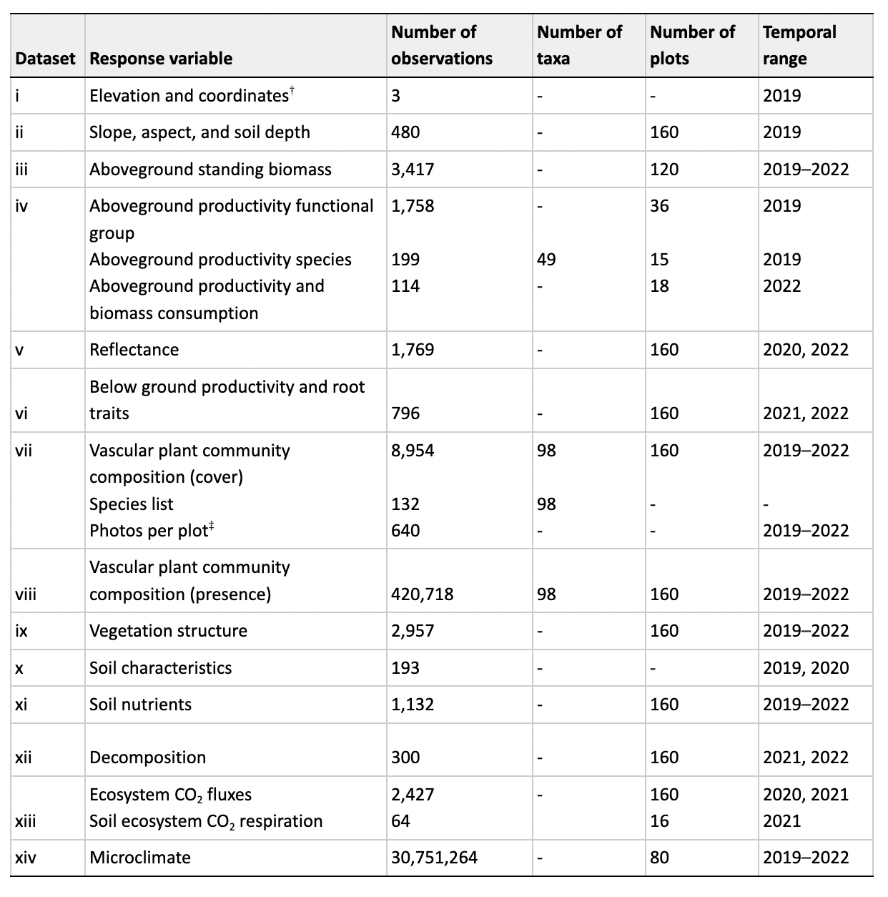
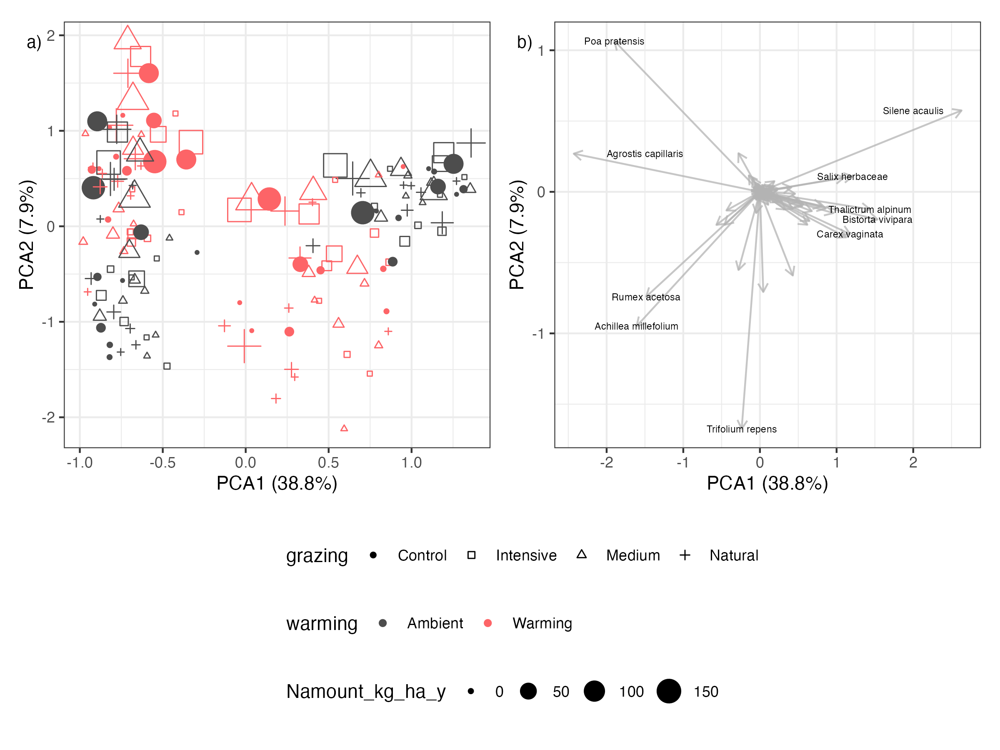
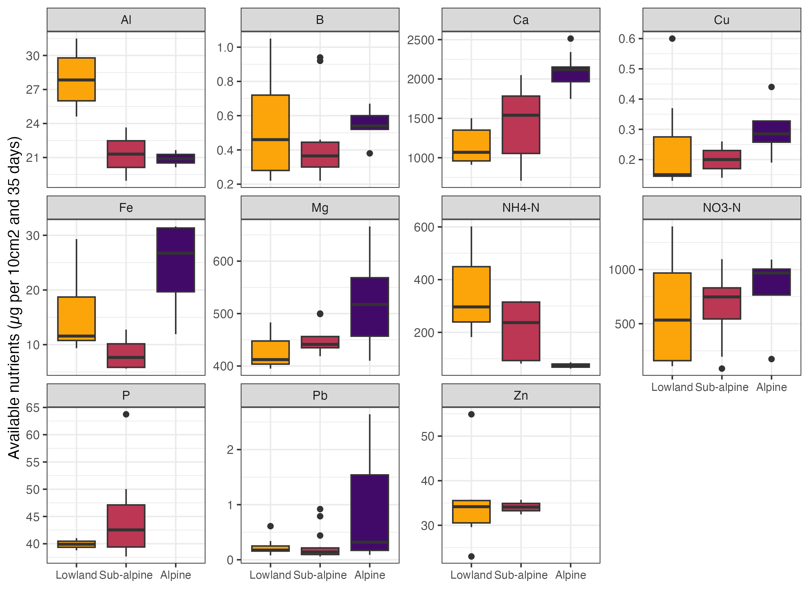

This repository reports on data from the ThreeD Global Change Experiment
replicated across an elevational gradient in an alpine and sub-alpine
grassland community in Western Norway. The datasets include the
treatment variables warming, nitrogen addition, grazing and clipping,
and response variables related to vegetation, soil structure, carbon and
nutrient stocks and ecosystem fluxes and microclimate collected from
2019 (the pre-treatment year) to 2022, with variable number of years of
data and temporal resolution between datasets (Table 1).

This is the git repository is associated with the data paper: Halbritter
et al. (submitted). The effect of warming, nitrogen addition and grazing
on alpine biodiversity and ecosystem function in Norway. Data science.

# Summary

Multiple global change drivers including land-use and climate change,
and pollution threaten alpine biodiversity and ecosystem functions.
Experimental approaches can be used to disentangle the single and
interactive effects of these drivers. Across three sites along an
elevational gradient (469 - 1290 m a.s.l.) in south-western Norway, we
exposed plant communities to warmer climate, nitrogen fertilization, and
grazing, as well as simulated grazing by clipping, in a fully factorial
design (Figure 1). After three years of treatment, we recorded data on
vegetation, ecosystem functioning, and microclimate in 160 experimental
and control plots. This database consists of records of the following
datasets: aboveground standing biomass (3,417 records), aboveground
plant productivity (2,071), reflectance (1,769), vascular plant
community composition (8,954 records covering 95 taxa), below ground
productivity and traits (796), soil characteristics (193), soil nutrient
(1,132), ecosystem CO2 fluxes (2427), soil ecosystem CO2 respiration
(64), and microclimate (30,751,264). The data can be combined with
long-term climate and plant functional traits collected within the study
region.

<figure>

<figcaption aria-hidden="true"><em>Figure 1 Experimental setup,
location, and plot design. (a) Experimental setup in a sub-alpine and
alpine plant community along an elevational gradient with three sites.
Inset shows map of Norway and location of experiment. The experiment
includes a fully factorial design of warming by transplanting, nitrogen
addition and clipping and grazing. The treatments are ambient (grey to
brown), warming (pink to brown), nitrogen addition (colour gradient),
ungrazed (C), intermediate (one scissor) and intensive (two scissors)
clipping, and natural grazing outside the grazing exclosure (sheep). The
arrows indicate the direction of transplant. (b) Map showing the
location of the three sites: boreal, sub-alpine, and alpine sites. (c)
Plot design with the outer area for destructive harvest and inner
non-destructive area for long-term monitoring. The global change
treatments (warming, nitrogen addition, clipping and grazing) were
applied on the whole 50 x 50 cm plot.</em></figcaption>
</figure>

More information about the project is on the [Three-D
wepage](http://www.audhalbritter.com/three-d/)

# Data description

The data outputs consist of 14 datasets, (i) elevation and coordinates
collected from all sites, (ii) slope, aspect and soil depth from all
plots in 2019, (iii) aboveground standing biomass from 2020 through
2022, (iv) aboveground productivity and biomass consumption from 2022,
(v) reflectance from 2020 and 2022, (vi) below ground root productivity
and traits from 2021 and 2022, (vii) vascular plant community
composition (cover) from all plots in 2019–2022, (viii) vascular plant
community composition presence at the subplot level from all plots from
2019 through 2022, (ix) vegetation structure (functional group cover and
vegetation height) from all plots between 2019 and 2022 (x), soil
characteristics data from 2019 and 2020, (xi) soil nutrients at site or
plot level from 2019 to 2022, (xii) decomposition data from 2021 and
2022, (xiii) ecosystem CO2 fluxes from 2020 to 2021 and soil respiration
from 2021, and (xiv) microclimate from 2019 through 2022 (Table 1).

<figure>

<figcaption aria-hidden="true"><em>Table 1 Description and location of
the datasets in the ThreeD global change experiment. This table shows
the dataset number, response variable(s), number of observations, number
of taxa, and temporal range of the data. The raw and final published
data are available on OSF24, and the code for extracting and cleaning
raw data is available on GitHub25. Note that for some datasets only
clean data† or raw data‡ are available.</em></figcaption>
</figure>

## Data organization and structure

The raw data files are available on [OSF](https://osf.io/pk4bg/) and are
stored in a folder called “RawData”. The filename starts with the number
of the data file corresponding to Table 1. All raw data files are
indicated with “raw” and have an associated readme file or a tab called
readme explaining all variables in the data files. The final data files
are available on [OSF](https://osf.io/pk4bg/). The file names all follow
the same structure: nr_Three-D_clean_variable_year(s).csv, where nr
refers to the dataset number in Table 1, the variable corresponds to the
response variable in Table 1. The code to clean and manage the data
files on OSF is available in this ThreeD GitHub repository with a
versioned copy archived in Zenodo (REF). All datasets for the ThreeD
Global Change Experiment are structured similarly, sharing some common
variables including year, date, siteID, blockID, plotID, turfID, and
treatments and specific variables that are unique to each dataset
(Figure 2). The shared variables can be used to link different datasets,
for example to combine them for specific analysis (bold letters in
Figure 2). For example the climate data can be joined by date, siteID,
blockID, plotID, turfID and treatments to the biomass to test the
relationship between soil temperature and biomass.

<figure>

<figcaption aria-hidden="true"><em>Figure 2 Data structure for the
ThreeD global change experiment. The boxes represent the dataset i to xv
(see Table 1) with the names of each dataset shown in the coloured area.
The main variables of each dataset are shown below and for the full list
of variables for each dataset see Tables 2–16. The variables in bold
indicate keys that can be used to join the different datasets (Table 2).
The line linking the variable species indicates one example for such a
link. These keys can also be used to link to data from the Plant
Functional Trait Course 6 (PFTC6) and the Vestland Climate Grid (VCG) in
Vestland County in Norway and are explained in the box at the bottom.
Three example datasets with their keys are shown. Abbreviations stand
for: SOM = soil organic matter, veg. = vegetation, nee = net ecosystem
exchange, gpp = gross primary production, and ER = ecosystem
respiration.</em></figcaption>
</figure>

Datasets collected at plot level that include the warming treatment
(transplant) contain plots that have been moved from the “origin” site
to the “destination” site. The siteID, blockID and plotID therefore
contain the prefix origin or dest (for destination) to indicate if the
variable refers to the origin or destination. For control plots that
have not been moved, the origin and destination is the same.

### Download clean data

To download the clean data from OSF use the dataDownloader package. This
is how to install and load the package.

``` r
devtools::install_github("Between-the-Fjords/dataDownloader")
library("dataDownloader")
```

Here is an example for how to download the biomass data:

``` r
get_file(node = "pk4bg",
         file = "3_Three-D_clean_biomass_2020-2022.csv",
         path = "data")
```

## Data sets and data dictionary

### Dataset (i) Elevation and coordinates

This dataset contains elevation, latitude, and longitude for each site
and has three observations.

| Variable name | Description | Variable type | Variable range or levels | Units | How measured |
|:---|:---|:---|:---|:---|:---|
| destSiteID | Unique site ID of destination site | categorical | Joasete - Vikesland | NA | defined |
| elevation_m_asl | Elevation of site | numeric | 469 - 1290 | m a.s.l. | recorded |
| latitude_N | Latitude of site | numeric | 60.86 - 60.88 | degree N | recorded |
| longitude_E | Longitude of site | numeric | 7.168 - 7.195 | degree E | recorded |

### Dataset (ii) Slope, aspect, and soil depth

This dataset contains slope, aspect and soil depth and has 480
observations. The average slope was 8.9 ± 0.15 degrees at the boreal
site, 11.0 ± 0.07 degrees at the sub-alpine site and 12.4 ± 0.13 degrees
at the alpine site. The aspect was 270 ± 1.23, 247 ± 0.89, and 246 ±
1.42 degrees at the boreal, sub-alpine and alpine sites, respectively.
The soil was deepest at the boreal site (15 ± 0.13), and was shallower
at the sub-alpine site (13.0 ± 0.05) and alpine site (11.7 ± 0.09;
Figure 3).

<figure>

<figcaption aria-hidden="true"><em>Figure 3 Soil characteristics at the
boreal, sub-alpine and alpine sites. Shown are soil depth, bulk density,
pH, carbon and nitrogen content, and soil organic matter. The colours
indicate the site. Note that the measurements were done at different
layers (i.e. the top 5 cm, below the top 5 cm, or the total soil core).
Bulk density was measured at both the top 5cm (lighter colour) and below
the first 5 cm (darker colour). pH was measured in the top 5 cm and the
other variables were all measured for the total soil
core.</em></figcaption>
</figure>

| Variable name | Description | Variable type | Variable range or levels | Units | How measured |
|:---|:---|:---|:---|:---|:---|
| year | Year of the sampling | numeric | 2019 - 2019 | 2019 | recorded |
| origSiteID | Unique site ID of origin site | categorical | Joasete - Liahovden | NA | defined |
| origBlockID | Unique origin block ID as number 1 to 10 | numeric | 1 - 10 | NA | defined |
| origPlotID | Unique numeric origin plot ID for geographic location of the turf | numeric | 1 - 160 | NA | defined |
| destSiteID | Unique site ID of destination site | categorical | Joasete - Vikesland | NA | defined |
| destPlotID | Unique destination block ID as number 1 to 10 | numeric | 2 - 200 | NA | defined |
| destBlockID | Unique numeric destination plot ID for geographic location of the turf | numeric | 1 - 10 | NA | defined |
| turfID | Unique ID of vegetation turf as originplotID, warming, nitrogen and grazing treatment and destinationplotID | categorical | 1 WN1M 84 - 99 WN5C 170 | NA | defined |
| warming | Warming treatment as W for warming or A for ambient | categorical | A - W | NA | defined |
| grazing | Grazing treatment as C for control, I for intensive, M for medium clipping, and N for natural grazing | categorical | C - N | NA | defined |
| Nlevel | Nitrogen level treatment as numeric value from 1 - 10 | numeric | 1 - 10 | NA | defined |
| Namount_kg_ha_y | Amount of nitrogen added between 0 and 150 kg per ha and year | numeric | 0 - 150 | kg ha-1 y-1 | defined |
| date_slope | Date of sampling slope and aspect | date | 2019-07-04 - 2019-07-17 | dd-mm-yy | recorded |
| slope | Slope of the plot | numeric | 0.3 - 28 | degree | measured |
| aspect | Aspect of the plot | numeric | 2 - 380 | degree | measured |
| date_depth | Date of sampling soil depth. | date | 2019-06-24 - 2019-07-17 | dd-mm-yy | recorded |
| soil_depth_cm | Soil depth measurement of the plot | numeric | 4.625 - 36.1 | cm | measured |
| remark | Comment on measurement, recording or observation | categorical | soil depth 1 \> 32.5cm - soil depth 3 \> 46 cm | NA | recorded |

### Dataset (iii): Aboveground standing biomass

This dataset contains the aboveground standing biomass from the clipping
treatments in 2020 to 2022 and from the control plots in 2022. The
biomass is separated by functional groups and this dataset has a total
of 3417 observations, including 188 from control plots, 1175 from
intermediate clipped and 2054 from intensive clipped plots. In 2022, in
total 1502 g biomass was removed in the control plots, and in total 1315
g biomass was removed in the intermediate and 1239 g in the intensive
clipped plots per year.

In terms of aboveground standing biomass, forb biomass dominated in the
alpine site, while graminoid biomass dominated in the sub-alpine site
(Figure 4). With warming in the alpine site, forb biomass decreases
while graminoid biomass increases. Shrubs and Cyperaceae almost
exclusively occur in the alpine site, and decrease with warming.
Bryophyte, legume and litter biomass is generally low. Legumes occur in
the warmed alpine plots.

<figure>

<figcaption aria-hidden="true"><em>Figure 4 Proportional functional
group composition. Proportion of biomass per plant functional group at
peak growing season in 2022. Shown are the proportion of shrubs,
graminoids (grasses and rushes), Cyperaceae (mostly Carex species),
forbs, legumes, bryophytes, and litter, for the different nitrogen
addition treatments in non-grazed (Control), medium and intensive grazed
plots. The two top rows are the ambient and warmed plots in the alpine
site, while the two lower rows are ambient and warmed plots at the
subalpine site. The general pattern is that graminoids increase and
forbs decrease with higher nitrogen addition
treatment.</em></figcaption>
</figure>

| Variable name | Description | Variable type | Variable range or levels | Units | How measured |
|:---|:---|:---|:---|:---|:---|
| year | Year of the sampling | numeric | 2020 - 2022 | 2019 | recorded |
| date | Date of sampling | date_time | 2010-09-10 - 2022-09-01 | yyyy-mm-dd | recorded |
| origSiteID | Unique site ID of origin site | categorical | Joasete - Liahovden | NA | defined |
| origBlockID | Unique origin block ID as number 1 to 10 | numeric | 1 - 10 | NA | defined |
| origPlotID | Unique numeric origin plot ID for geographic location of the turf | numeric | 1 - 158 | NA | defined |
| turfID | Unique ID of vegetation turf as originplotID, warming, nitrogen and grazing treatment and destinationplotID | categorical | 1 WN1M 84 - 99 WN5C 170 | NA | defined |
| destSiteID | Unique site ID of destination site | categorical | Joasete - Vikesland | NA | defined |
| destBlockID | Unique numeric destination plot ID for geographic location of the turf | numeric | 1 - 10 | NA | defined |
| destPlotID | Unique destination block ID as number 1 to 10 | numeric | 2 - 199 | NA | defined |
| warming | Warming treatment as W for warming or A for ambient | categorical | A - W | NA | defined |
| Nlevel | Nitrogen level treatment as numeric value from 1 - 10 | numeric | 1 - 10 | NA | defined |
| Namount_kg_ha_y | Amount of nitrogen added between 0 and 150 kg per ha and year | numeric | 0 - 150 | kg ha-1 y-1 | defined |
| grazing | Grazing treatment as C for control, I for intensive, M for medium clipping, and N for natural grazing | categorical | C - M | NA | defined |
| cut | Number of cuts for the intermediate and intensive clipping treatments | numeric | 1 - 4 | NA | recorded |
| fun_group | Functional group including forbs, graminoids, Cyperaceae, legumes, bryophytes, and litter | categorical | bryophytes - shrub | NA | defined |
| biomass | Amount of biomass removed per plot | numeric | 0 - 86.54 | g | measured |
| area_cm2 | Plot size in cm2 | numeric | 223 - 2500 | cm2 | recorded |
| collector | Data collector | categorical | A+M - x | NA | recorded |
| remark | Comment on measurement, recording or observation | categorical | 03.07.2020 (?) - Shrub bag missing | NA | recorded |
| unit | Unit for biomass is gram | categorical | g - g | NA | recorded |

### Dataset (iv): Aboveground plant productivity

This dataset contains the aboveground plant productivity from grazed
control plots and ungrazed caged plots at all three sites in 2019 (at
functional group and species level) and 2022 (at functional group level)
and has a total of 2,071 observations.

In 2019, annual productivity (summed biomass from caged plots) was
consistently higher in the permanent plot compared to the temporary
plots. Productivity was similar at the boreal (permanent: 0.050 ± 0.005
g cm<sup>-2</sup> y<sup>-1</sup>; temporary: 0.021 ± 0.002 g
cm<sup>-2</sup> y<sup>-1</sup>) and sub-alpine site (permanent: 0.036 ±
0.003 g cm<sup>-2</sup> y<sup>-1</sup>; temporary: 0.025 ± 0.002 g
cm<sup>-2</sup> y<sup>-1</sup>), and lower at the alpine site
(permanent: 0.018 ± 0.003 g cm<sup>-2</sup> y<sup>-1</sup>; temporary:
0.014 ± 0.002 g cm<sup>-2</sup> y<sup>-1</sup>).

In 2022, annual plant productivity (summed biomass from caged plots) was
the same at the boreal site (0.102 ± 0.008 g cm<sup>-2</sup>
y<sup>-1</sup>) and the sub-alpine site (0.106 ± 0.011 g cm<sup>-2</sup>
y<sup>-1</sup>), but decreased at the alpine site (0.026 ± 0.002 g
cm<sup>-2</sup> y<sup>-1</sup>). The consumed biomass (cage - control)
was the same at the two lower sites (boreal: 0.017 ± 0.005 g
cm<sup>-2</sup> y<sup>-1</sup>; sub-alpine: 0.017 ± 0.015 g
cm<sup>-2</sup> y<sup>-1</sup>), and decreased at the alpine site (0.003
± 0.002 g cm<sup>-2</sup> y<sup>-1</sup>), but this was not
statistically different.

**Functional group level data - 2019**

| Variable name | Description | Variable type | Variable range or levels | Units | How measured |
|:---|:---|:---|:---|:---|:---|
| date | Date of sampling | date | 2019-05-28 - 2019-09-20 | yyyy-mm-dd | recorded |
| destSiteID | Unique site ID of destination site | categorical | Joasete - Vikesland | NA | defined |
| destPlotID | Unique destination block ID as number 1 to 10 | categorical | J1C - V3CP | NA | defined |
| plot_nr | Number of replicates. | numeric | 1 - 3 | NA | recorded |
| type | Type of flux measurements (ER, NEE or GPP; numbers designate light response curves) | categorical | permanent - temporary | NA | defined |
| functional_group | Plant functional group | categorical | bryophytes - shrubs | NA | literature |
| productivity | Amount of biomass produced between each harvest. | numeric | 0 - 38 | NA | measured |
| replicate | Replicate measurement of same turf | numeric | 1 - 4 | NA | defined |
| soilmoisture | Volumetric soil moisture | numeric | 0 - 75.1 | percentage volume | measured |
| recorder | Name of person that recorded the data | categorical | Daniel - Inge | NA | recorded |
| campaign | Number of times measured during the growing season | numeric | 1 - 3 | NA | recorded |
| type | Type of measurement including permanent (i.e. same location) and temporary (i.e. change location after each harvest) placement of the plots. | categorical | permanent - temporary | NA | recorded |
| treatment | Treatment including cage (grazing exclusion) and control (allowing for grazing) | categorical | Cage - Control | NA | recorded |
| functional_group | Functional group including forbs, graminoids, and shrubs | categorical | bryophytes - shrubs | NA | recorded |
| pH | pH value of soil sample | categorical | 3.3 - 6.5 | NA | measured |
| replicate | Replicate measurement | numeric | 1 - 4 | NA | recorded |

**Species level data - 2019**

| Variable name | Description | Variable type | Variable range or levels | Units | How measured |
|:---|:---|:---|:---|:---|:---|
| date | Date of sampling | date | 2019-07-09 - 2019-09-01 | yyyy-mm-dd | recorded |
| destSiteID | Unique site ID of destination site | categorical | Joesete - Vikesland | NA | defined |
| destPlotID | Unique destination block ID as number 1 to 10 | categorical | B2C - V3Cage2 | NA | defined |
| type | Type of flux measurements (ER, NEE or GPP; numbers designate light response curves) | categorical | temporary - temporary | NA | defined |
| plot_nr | Number of replicates. | numeric | 1 - 3 | NA | recorded |
| species | Latin genus and species name | categorical | Achillea millefolium - Viola palustris | NA | identified |
| productivity | Amount of biomass produced between each harvest. | numeric | 0 - 13.44 | NA | measured |
| campaign | Number of times measured during the growing season | numeric | 1 - 2 | NA | recorded |
| type | Type of measurement including permanent (i.e. same location) and temporary (i.e. change location after each harvest) placement of the plots. | categorical | temporary - temporary | NA | recorded |
| treatment | Treatment including cage (grazing exclusion) and control (allowing for grazing) | categorical | Cage - Control | NA | recorded |

**Functional group level data - 2022**

| Variable name | Description | Variable type | Variable range or levels | Units | How measured |
|:---|:---|:---|:---|:---|:---|
| date_in | Date when cage/control plot was set up | date_time | 2022-05-31 - 2022-08-18 | yyyy-mm-dd | recorded |
| date_out | Date when cage/control plot was harvested | date_time | 2022-05-31 - 2022-09-02 | yyyy-mm-dd | recorded |
| destSiteID | Unique site ID of destination site | categorical | Joasete - Vikesland | NA | defined |
| plot_nr | Number of replicates. | numeric | 1 - 3 | NA | recorded |
| area_cm2 | Plot size in cm2 | numeric | 900 - 900 | cm2 | recorded |
| productivity | Amount of biomass produced between each harvest. | numeric | 0.001 - 0.043 | NA | measured |
| remark | Comment on measurement, recording or observation | categorical | Previously cage changed to control because no date_in and assume it was not there before - Previously cage changed to control because no date_in and assume it was not there before | NA | recorded |
| duration | Time between biomass harvests. | NA | NA | days | calculated |
| treatment | Grazed control plots (Control) and ungrazed cages (Cage). The summed biomass in the caged plots is annual plant productivity and the difference in biomass between cage and control is the consumed biomass. | categorical | Cage - Control | NA | recorded |

### Dataset (v): Reflectance

The reflectance dataset contains a total of 1,769 observations. There
are 1,689 observations, representing several measurements from all plots
in 2020, and 80 observations from one round of measurements at the
alpine site in 2022. The NDVI values are on average around 0.69 % ±
0.004 (range: 0.29–0.96 %). NDVI was lower at the start (June: 0.52 % ±
0.007) and end of the growing season (September: 0.51 % ± 0.007) and was
higher at peak growing season (0.76 % ± 0.003).

| Variable name | Description | Variable type | Variable range or levels | Units | How measured |
|:---|:---|:---|:---|:---|:---|
| year | Year of the sampling | numeric | 2020 - 2022 | 2019 | recorded |
| date | Date of sampling | date | 2020-06-26 - 2022-07-27 | yyyy-mm-dd | recorded |
| origSiteID | Unique site ID of origin site | categorical | Joasete - Liahovden | NA | defined |
| origBlockID | Unique origin block ID as number 1 to 10 | numeric | 1 - 10 | NA | defined |
| warming | Warming treatment as W for warming or A for ambient | categorical | A - W | NA | defined |
| grazing | Grazing treatment as C for control, I for intensive, M for medium clipping, and N for natural grazing | categorical | C - N | NA | defined |
| Nlevel | Nitrogen level treatment as numeric value from 1 - 10 | numeric | 1 - 10 | NA | defined |
| Namount_kg_ha_y | Amount of nitrogen added between 0 and 150 kg per ha and year | numeric | 0 - 150 | kg ha-1 y-1 | defined |
| origPlotID | Unique numeric origin plot ID for geographic location of the turf | numeric | 1 - 160 | NA | defined |
| destSiteID | Unique site ID of destination site | categorical | Joasete - Vikesland | NA | defined |
| destPlotID | Unique destination block ID as number 1 to 10 | numeric | 2 - 200 | NA | defined |
| destBlockID | Unique numeric destination plot ID for geographic location of the turf | numeric | 1 - 10 | NA | defined |
| turfID | Unique ID of vegetation turf as originplotID, warming, nitrogen and grazing treatment and destinationplotID | categorical | 1 WN1M 84 - 99 WN5C 170 | NA | defined |
| replicate | Replicate measurement of same turf | numeric | 1 - 2 | NA | defined |
| ndvi | Normalized Difference Vegetation Index measured per plot | numeric | 0.29 - 0.96 | percentage | measured |
| remark | Comment on measurement, recording or observation | categorical | flat light - shadow | NA | recorded |
| flux_campaign | Campaign for the carbon flux measurements | numeric | 2 - 4 | NA | defined |
| timing | Timing of measurement in relation to cutting treatment | categorical | after 1. cut - before treatment | NA | defined |

### Dataset (vi) Below ground productivity and root traits

The below ground productivity (i.e. fine root productivity) and root
traits dataset contains a total of 796 observations. The data from 2021
contains below ground productivity from one growing season
(i.e. May/June - September; n = 160). The data from 2022 contains 636
observations of annual below ground productivity as well as root traits.

The growing season below ground productivity was 2 times higher in the
sub-alpine (2.53 ± 0.271 mg cm<sup>-3</sup> per growing season) than the
alpine site (1.24 ± 0.309 mg cm<sup>-3</sup> per growing season). The
annual below ground productivity was 2.3 times higher in the sub-alpine
(2.16 ± 0.268 mg cm<sup>-3</sup> y<sup>-1</sup>) than the alpine site
(0.95 ± 0.228 mg cm<sup>-3</sup> y<sup>-1</sup>). The below ground
productivity for one growing season was 17% higher at the sub-alpine
site and 30% higher in the alpine site compared to annual growth. This
suggests that there is little growth outside the growing season and a
considerable amount of root death. Note that the amount of dead roots
were however not assessed.

Root dry matter content (RDMC) and root tissue density (RTD) were
slightly higher in the sub-alpine compared to the alpine site (RDMC
sub-alpine: 45.6 ± 3.69 mg g<sup>-1</sup>, alpine: 36.1 ± 6.51 mg
g<sup>-1</sup>; RTD sub-alpine: 0.203 ± 0.013 g cm<sup>-3</sup>, alpine:
0.171 ± 0.009 g cm<sup>-3</sup> ), while the pattern was opposite for
specific root length (sub-alpine: 173 ± 22.7 m g<sup>-1</sup>, alpine:
251 ± 41.2 m g<sup>-1</sup> ), however none of the root traits differed
significantly between the two sites.

| Variable name | Description | Variable type | Variable range or levels | Units | How measured |
|:---|:---|:---|:---|:---|:---|
| year | Year of the sampling | numeric | 2021 - 2022 | 2019 | recorded |
| origSiteID | Unique site ID of origin site | categorical | Joasete - Liahovden | NA | defined |
| origBlockID | Unique origin block ID as number 1 to 10 | numeric | 1 - 10 | NA | defined |
| origPlotID | Unique numeric origin plot ID for geographic location of the turf | numeric | 1 - 160 | NA | defined |
| destSiteID | Unique site ID of destination site | categorical | Joasete - Vikesland | NA | defined |
| destBlockID | Unique numeric destination plot ID for geographic location of the turf | numeric | 1 - 10 | NA | defined |
| destPlotID | Unique destination block ID as number 1 to 10 | numeric | 2 - 200 | NA | defined |
| turfID | Unique ID of vegetation turf as originplotID, warming, nitrogen and grazing treatment and destinationplotID | categorical | 1 WN1M 84 - 99 WN5C 170 | NA | defined |
| warming | Warming treatment as W for warming or A for ambient | categorical | A - W | NA | defined |
| grazing | Grazing treatment as C for control, I for intensive, M for medium clipping, and N for natural grazing | categorical | C - N | NA | defined |
| Nlevel | Nitrogen level treatment as numeric value from 1 - 10 | numeric | 1 - 10 | NA | defined |
| Namount_kg_ha_y | Amount of nitrogen added between 0 and 150 kg per ha and year | numeric | 0 - 150 | kg ha-1 y-1 | defined |
| sampleID | Soil sample ID | categorical | 100AN5M100 - 9AN6M9 | NA | defined |
| days_buried | Duration of root growth in days | NA | NA | days | calculated |
| period | Period for root productivity measurement: growing season or annual | categorical | annual - growing season | NA | calculated |
| variable | Belowground productivity (g cm-3 y-1) and root traits, including specific root length (m g-1), root tissue density (g cm-3), and root dry matter content (mg g-1) | categorical | root_dry_matter_content - specific_root_length | NA | defined |
| value | Value for below ground productivity or root trait | numeric | 0 - 366.168 | g cm-3 y-1, m g-1, g cm-3, mg g-1, | measured |
| volume_cm3 | Root ingrowth core volume | numeric | 36.56 - 101.984 | cm3 | recorded |
| burial_date | Date of incubation of root ingrowth core | date | 2021-05-30 - 2021-06-21 | yyyy-mm-dd | recorded |
| recover_date | Date of recovery of root ingrowth core | date | 2021-09-20 - 2022-06-29 | yyyy-mm-dd | recorded |

### Datasets (vii, viii): Vascular plant community composition

The vascular plant community composition dataset contains a total of 98
identified taxa and 8,954 observations of cover data at the plot level.
The dataset contains 13 observations (0.15 %) with unidentified species
and 542 observations (6.1 %) identified to the genus level.

The species composition differed between the alpine and sub-alpine plant
communities, with alpine communities on the right side of the principle
component analysis (PCA; Figure 5). The first PCA axis explained 38.8 %
of the variation and is strongly related to warming in the alpine
community, while the second PCA axis explained 7.9 % of the variation
and was more related to warming in the sub-alpine community and nitrogen
addition. Grazing and clipping did not show a clear pattern in the
ordination.

Species richness varied between 4 and 37 species per plot and was on
average higher at the alpine site (24.3 ± 0.29) compared to the
sub-alpine site (9.7 ± 0.15).

<figure>

<figcaption aria-hidden="true"><em>Figure 5 Ordination of vascular plant
species composition. a) Principal component analysis of square root
transformed species occurrence data from the ThreeD global change
experiment. Colours indicate ambient (grey) and warmed (pink)
conditions, shape shows the different grazing and clipping treatments
and the size indicates the nitrogen addition level. b) Species loadings
with the most important species labeled.</em></figcaption>
</figure>

**Species cover**

| Variable name | Description | Variable type | Variable range or levels | Units | How measured |
|:---|:---|:---|:---|:---|:---|
| year | Year of the sampling | numeric | 2019 - 2022 | 2019 | recorded |
| date | Date of sampling | date | 2019-07-02 - 2022-08-12 | yyyy-mm-dd | recorded |
| origSiteID | Unique site ID of origin site | categorical | Joasete - Liahovden | NA | defined |
| origBlockID | Unique origin block ID as number 1 to 10 | numeric | 1 - 10 | NA | defined |
| origPlotID | Unique numeric origin plot ID for geographic location of the turf | numeric | 1 - 160 | NA | defined |
| destSiteID | Unique site ID of destination site | categorical | Joasete - Vikesland | NA | defined |
| destBlockID | Unique numeric destination plot ID for geographic location of the turf | numeric | 1 - 10 | NA | defined |
| destPlotID | Unique destination block ID as number 1 to 10 | numeric | 2 - 200 | NA | defined |
| turfID | Unique ID of vegetation turf as originplotID, warming, nitrogen and grazing treatment and destinationplotID | categorical | 1 WN1M 84 - 99 WN5C 170 | NA | defined |
| warming | Warming treatment as W for warming or A for ambient | categorical | A - W | NA | defined |
| grazing | Grazing treatment as C for control, I for intensive, M for medium clipping, and N for natural grazing | categorical | C - N | NA | defined |
| Nlevel | Nitrogen level treatment as numeric value from 1 - 10 | numeric | 1 - 10 | NA | defined |
| Namount_kg_ha_y | Amount of nitrogen added between 0 and 150 kg per ha and year | numeric | 0 - 150 | kg ha-1 y-1 | defined |
| species | Latin genus and species name | categorical | Achillea millefolium - Viola palustris | NA | identified |
| cover | Percent cover of a species per plot | numeric | 1 - 80 | percentage | recorded |
| recorder | Name of person that recorded the data | categorical | aud - vigdis | NA | recorded |
| scribe | Name of scribe | categorical | aud - silje | NA | recorded |
| remark | Comment on measurement, recording or observation | categorical | 0.3-0.4cm brei, lang rett relativt langstrekt spiss. pilulifera? m form, matt gulgrønn. alt er gul her! - yellow green leaves, ca 5m, little m shape, tips cut, maybe carex leporina or brunecsene like other plots in block 10 | NA | recorded |
| file | Name of file in the raw data | categorical | data/community/2019/Joa/THREE-D_CommunityData_Joasete_1_2019.xlsx - data/community/2022/Vik/THREE-D_CommunityData_Vikesland_9_2022_iPad.xlsx | NA | recorded |

**Presences data**

| Variable name | Description | Variable type | Variable range or levels | Units | How measured |
|:---|:---|:---|:---|:---|:---|
| year | Year of the sampling | numeric | 2019 - 2022 | 2019 | recorded |
| date | Date of sampling | date | 2019-07-02 - 2022-08-12 | yyyy-mm-dd | recorded |
| origSiteID | Unique site ID of origin site | categorical | Joasete - Liahovden | NA | defined |
| origBlockID | Unique origin block ID as number 1 to 10 | numeric | 1 - 10 | NA | defined |
| origPlotID | Unique numeric origin plot ID for geographic location of the turf | numeric | 1 - 160 | NA | defined |
| destSiteID | Unique site ID of destination site | categorical | Joasete - Vikesland | NA | defined |
| destBlockID | Unique numeric destination plot ID for geographic location of the turf | numeric | 1 - 10 | NA | defined |
| destPlotID | Unique destination block ID as number 1 to 10 | numeric | 2 - 200 | NA | defined |
| turfID | Unique ID of vegetation turf as originplotID, warming, nitrogen and grazing treatment and destinationplotID | categorical | 1 WN1M 84 - 99 WN5C 170 | NA | defined |
| warming | Warming treatment as W for warming or A for ambient | categorical | A - W | NA | defined |
| grazing | Grazing treatment as C for control, I for intensive, M for medium clipping, and N for natural grazing | categorical | C - N | NA | defined |
| Nlevel | Nitrogen level treatment as numeric value from 1 - 10 | numeric | 1 - 10 | NA | defined |
| Namount_kg_ha_y | Amount of nitrogen added between 0 and 150 kg per ha and year | numeric | 0 - 150 | kg ha-1 y-1 | defined |
| subplot | Location of subplot within the plot | categorical | 1 - 9 | NA | defined |
| species | Latin genus and species name | categorical | Achillea millefolium - Viola palustris | NA | identified |
| remark | Comment on measurement, recording or observation | categorical | 0.3-0.4cm brei, lang rett relativt langstrekt spiss. pilulifera? m form, matt gulgrønn. alt er gul her! - yellow green leaves, ca 5m, little m shape, tips cut, maybe carex leporina or brunecsene like other plots in block 10 | NA | recorded |
| recorder | Name of person that recorded the data | categorical | aud - vigdis | NA | recorded |
| variable | Variable including presence, fertility, dominant (\> 50% of cover), juvenile or seedling | categorical | dominant - seedling | NA | defined |
| value | Presence or absence indicated with 1 for presence and 0 for absence | numeric | 0 - 1 | NA | recorded |

### Dataset (ix): Vegetation structure

The vegetation structure dataset has 4’237 observations. Sum of cover
(i.e. the sum of vascular plant cover including the layering of
vegetation which can exceed 100 %) was on average 102 ± 1.0 % per plot
(range: 39–177 %), while vascular plant cover (without layering of the
vegetation) was 81.5 ± 2.1 % (range: 5–100 %). Sum of cover was higher
at the sub-alpine site, while vascular plant cover did not differ. The
average litter cover was 31.0 ± 2.1 % per plot (range: 2.3–99.5 %),
bryophyte cover was 34.1 ± 2.22 % (range: 0.1–96.0 %), and lichen cover
5.16 ± 0.739 % (range: 0.2–24.9 %). Litter and bryophyte covers were
significantly higher at the sub-alpine site. Plots had on average 2.8 ±
0.6 % bare soil cover (range: 0.2–13.8 %) and 1.75 ± 1.1 % rock cover
(range: 0.2–8.0 %).

Vegetation height was on average 7.49 ± 0.44 cm (range: 0 - 23.5 cm) and
bryophyte depth 2.31 ± 0.12 cm (range: 0 - 7 cm). The vegetation height
was on average 5.75 cm taller and bryophyte depth was 1.78 cm deeper at
the sub-alpine compared to the alpine site.

| Variable name | Description | Variable type | Variable range or levels | Units | How measured |
|:---|:---|:---|:---|:---|:---|
| year | Year of the sampling | numeric | 2019 - 2022 | 2019 | recorded |
| date | Date of sampling | date | 2019-07-02 - 2022-08-12 | yyyy-mm-dd | recorded |
| origSiteID | Unique site ID of origin site | categorical | Joasete - Liahovden | NA | defined |
| origBlockID | Unique origin block ID as number 1 to 10 | numeric | 1 - 10 | NA | defined |
| origPlotID | Unique numeric origin plot ID for geographic location of the turf | numeric | 1 - 160 | NA | defined |
| destSiteID | Unique site ID of destination site | categorical | Joasete - Vikesland | NA | defined |
| destPlotID | Unique destination block ID as number 1 to 10 | numeric | 2 - 200 | NA | defined |
| destBlockID | Unique numeric destination plot ID for geographic location of the turf | numeric | 1 - 10 | NA | defined |
| turfID | Unique ID of vegetation turf as originplotID, warming, nitrogen and grazing treatment and destinationplotID | categorical | 1 WN1M 84 - 99 WN5C 170 | NA | defined |
| warming | Warming treatment as W for warming or A for ambient | categorical | A - W | NA | defined |
| grazing | Grazing treatment as C for control, I for intensive, M for medium clipping, and N for natural grazing | categorical | C - N | NA | defined |
| Nlevel | Nitrogen level treatment as numeric value from 1 - 10 | numeric | 1 - 10 | NA | defined |
| Namount_kg_ha_y | Amount of nitrogen added between 0 and 150 kg per ha and year | numeric | 0 - 150 | kg ha-1 y-1 | defined |
| functional_group | Plant functional group | categorical | bare rock - wool | NA | literature |
| recorder | Name of person that recorded the data | categorical | aud - vigdis | NA | recorded |
| variable | Variables including cover (the functional group cover of each plot; %), height (vegetation; cm), and depth (bryophyte; cm). | categorical | cover - sum_cover | NA | defined |
| functional_group | The functional groups include bryophytes, litter, vascular plants, lichen, faeces, bare soil, bare rock and wool; The variable sumofcover is the sum of cover of all species including the layering of vegetation; vegetation refers to the height of the vegetation and bryophyte to the moss depth. | categorical | bare rock - wool | NA | defined |
| value | Value for functional group cover, sumofcover or vegetation height and bryophyte depth. | numeric | 0 - 177 | percentage or cm | recorded |

### Dataset (x): Soil structure

The soil structure dataset contains a total of 193 observations from
2019 and 2020. Bulk density ranged between 0.4 to 1.3 g cm<sup>-3</sup>.
It was highest at the sub-alpine site (0.8 ± 0.07 g cm<sup>-3</sup>),
lowest at the alpine site (0.3 ± 0.04 g cm<sup>-3</sup>) and
intermediate at the boreal site (0.5 ± 0.04 g cm<sup>-3</sup>; Figure
3). The pH ranged between 4.1 and 5.52 and increased with elevation
(average pH at the boreal: 4.2 ± 0.02, sub-alpine: 4.5 ± 0.09 and
alpine: 5.2 ± 0.19; Figure 3). The sand content varied between 84.2 and
97.2 %, the silt content between 2.22 and 14.7 % and the clay content
between 0.42 and 1.12 %. The mean sand, silt and clay content did
however not differ between the three sites. Pore water content ranged
from 0.08 to 0.74 %. It was similar at the boreal (0.26 ± 0.03 %) and
sub-alpine sites (0.23 ± 0.08 %) and significantly higher at the alpine
site (0.55 ± 0.04 %).

| Variable name | Description | Variable type | Variable range or levels | Units | How measured |
|:---|:---|:---|:---|:---|:---|
| year | Year of the sampling | numeric | 2019 - 2020 | 2019 | recorded |
| date | Date of sampling | date_time | 2019-07-16 - 2020-10-16 | yyyy-mm-dd | recorded |
| destSiteID | Unique site ID of destination site | categorical | Joasete - Vikesland | NA | defined |
| destBlockID | Unique numeric destination plot ID for geographic location of the turf | categorical | 1 - 9-10 | NA | defined |
| layer | Layer at which soil sample was taken: top or bottom 5cm | categorical | Bottom - Top | NA | recorded |
| variable | Soil character variable including bulk density, pore water content, percentage sand, silt and clay, and pH | categorical | bulk_density_g_cm - silt_percent | NA | defined |
| value | Soil character value | numeric | 0.082 - 97.222 | gcm-3, % | measured |

### Dataset (xi): Soil nutrients

This dataset contains a total of 1132 observations from 2019 to 2022.
Carbon and nitrogen content both increased with elevation (Figure 3).
The mean soil carbon content was 12.3 ± 0.64 % at the boreal site, 17.4
± 0.88 % at the sub-alpine, and 29.7 ± 1.31 % at the alpine site. The
nitrogen content in the soil was on average 1.0 ± 0.04 % at the boreal
site, 1.3 ± 0.06 % at the sub-alpine site, and 2.2 ± 0.09 % at the
alpine site. Soil organic matter increased with elevation (Figure 3) and
was 0.21 ± 0.011 gm cm-3 at the boreal site, 0.32 ± 0.020 gm cm-3 at the
sub-alpine site, and 0.57 ± 0.028 gm cm-3 at the alpine site.

The available nutrients Al, Ca, Fe, Mg, and Pb varied between sites and
were higher at the alpine site compared to the boreal site (Figure 6).
There was no difference between the boreal and sub-alpine site for any
of the nutrients. All other available nutrients, B, Cu, NH4+, NO3-, P,
and Zn did not differ between the sites.

<figure>

<figcaption aria-hidden="true"><em>Figure 6 Available nutrients at the
lowland, sub-alpine and alpine sites. The available nutrients include
Al, B, Ca, Cu, Fe, Mg, NH4+, NO3-, P, Pb, and Zn.</em></figcaption>
</figure>

| Variable name | Description | Variable type | Variable range or levels | Units | How measured |
|:---|:---|:---|:---|:---|:---|
| year | Year of the sampling | numeric | 2019 - 2022 | 2019 | recorded |
| destSiteID | Unique site ID of destination site | categorical | Joasete - Vikesland | NA | defined |
| destBlockID | Unique numeric destination plot ID for geographic location of the turf | categorical | 1 - 9-10 | NA | defined |
| Nlevel | Nitrogen level treatment as numeric value from 1 - 10 | numeric | 1 - 10 | NA | defined |
| Namount_kg_ha_y | Amount of nitrogen added between 0 and 150 kg per ha and year | numeric | 0 - 150 | kg ha-1 y-1 | defined |
| turfID | Unique ID of vegetation turf as originplotID, warming, nitrogen and grazing treatment and destinationplotID | categorical | 1 WN1M 84 - 99 WN5C 170 | NA | defined |
| soil_depth_cm | Soil depth measurement of the plot | numeric | 3 - 11.5 | cm | measured |
| origSiteID | Unique site ID of origin site | NA | NA | NA | defined |
| origBlockID | Unique origin block ID as number 1 to 10 | numeric | 1 - 10 | NA | defined |
| warming | Warming treatment as W for warming or A for ambient | categorical | A - W | NA | defined |
| grazing | Grazing treatment as C for control, I for intensive, M for medium clipping, and N for natural grazing | categorical | C - N | NA | defined |
| origPlotID | Unique numeric origin plot ID for geographic location of the turf | numeric | 1 - 160 | NA | defined |
| destPlotID | Unique destination block ID as number 1 to 10 | numeric | 2 - 200 | NA | defined |
| date | Date of sampling | date_time | 2019-07-16 - 2019-07-22 | yyyy-mm-dd | recorded |
| sample_ID | Unique ID of sample | numeric | 1 - 160 | NA | defined |
| layer | Layer at which soil sample was taken: top or bottom 5cm | categorical | Bottom - Top | NA | recorded |
| variable | Soil nutrient variable including carbon and nitrogen content (%), soil organic matter (%), and the elements Al, B, Ca, Cd, Cu, Fe, K, Mg, Mn, NH4-N, NO3-N, P, Pb, S and Zn (grams/10cm2/35 days) | categorical | Al - Zn | NA | defined |
| value | Soil nutrient value | numeric | 0.009 - 2513.14 | %, micro grams/10cm2/35 days | measured |
| duration | Duration of PRS probe in the soil | NA | NA | days | recorded |
| detection_limit | Detection limit of element | numeric | 0.04 - 717.53 | NA | defined |
| burial_date | Burial date of PRS probe | date | 2021-07-07 - 2021-07-08 | NA | recorded |
| retrieval_date | Retrieval date of PRS probe | date | 2021-08-11 - 2021-08-12 | yyyy-mm-dd | recorded |
| Notes | Comment on measurement, recording or observation | categorical | 1 broken probe - 1 broken probe | NA | recorded |

### Dataset (xii): Decomposition

The dataset contains a total of 300 observations, with 155 from one
growing season in 2021 and 145 for a whole year from spring 2021 to
spring 2022. The proportion of green tea remaining after incubation
ranged between 26.3 and 86.4 % and for rooibos tea it was between 42.2
and 86.5 %. The remaining fraction of rooibos and green tea was
significantly lower in the sub-alpine site compared to the alpine site.
Decomposition rate (k) varied between 0.009 and 0.095 for the growing
season and 0.002 and 0.017 for the whole year. Stabilization factor (S)
varied between 0.125 and 0.699 during the growing season in 2021 and
between 0.148 and 0.838 for the whole year. Decomposition rate did not
differ between the alpine and sub-alpine site, but was lower for the
whole year compared to only growing season decomposition. The
stabilization factor was lower at the sub-alpine site compared to the
alpine site and was higher for the whole year decomposition.

| Variable name | Description | Variable type | Variable range or levels | Units | How measured |
|:---|:---|:---|:---|:---|:---|
| year | Year of the sampling | numeric | 2021 - 2022 | 2019 | recorded |
| origSiteID | Unique site ID of origin site | NA | NA | NA | defined |
| origBlockID | Unique origin block ID as number 1 to 10 | numeric | 1 - 10 | NA | defined |
| warming | Warming treatment as W for warming or A for ambient | categorical | A - W | NA | defined |
| grazing | Grazing treatment as C for control, I for intensive, M for medium clipping, and N for natural grazing | categorical | C - N | NA | defined |
| Nlevel | Nitrogen level treatment as numeric value from 1 - 10 | numeric | 1 - 10 | NA | defined |
| origPlotID | Unique numeric origin plot ID for geographic location of the turf | numeric | 1 - 160 | NA | defined |
| destSiteID | Unique site ID of destination site | categorical | Joasete - Vikesland | NA | defined |
| destPlotID | Unique destination block ID as number 1 to 10 | numeric | 2 - 200 | NA | defined |
| destBlockID | Unique numeric destination plot ID for geographic location of the turf | numeric | 1 - 10 | NA | defined |
| turfID | Unique ID of vegetation turf as originplotID, warming, nitrogen and grazing treatment and destinationplotID | categorical | 1 WN1M 84 - 99 WN5C 170 | NA | defined |
| Namount_kg_ha_y | Amount of nitrogen added between 0 and 150 kg per ha and year | numeric | 0 - 150 | kg ha-1 y-1 | defined |
| teabag_ID | Unique tea bag ID | numeric | 1 - 340 | NA | defined |
| timing | Time of recovery after one growing season or a whole year | categorical | growing season - year | NA | recorded |
| incubation_time | Incubation time of tea bags in days | numeric | 94 - 378 | days | recorded |
| k | Decomposition rate | numeric | 0.002 - 0.095 | NA | calculated |
| S | Stabilisation factor | numeric | 0.125 - 0.838 | NA | calculated |
| fraction_remaining_green | Fraction of green tea remaining after burial period | numeric | 0.263 - 0.864 | % | calculated |
| fraction_remaining_red | Fraction of rooibos tea remaining after burial period | numeric | 0.422 - 0.865 | % | calculated |
| flag | Flagging problematic data | categorical | hole in teabags - hole in teabags | NA | recorded |

### Dataset (xiii): Ecosystem CO2 fluxes

The 2020 CO2 fluxes dataset shows 440 measurements of ER, NEE and GPP
(calculated from ER and NEE). All four campaigns confounded, the warming
treatment increased GPP by 96% at the sub-alpine site and 38% at the
alpine site, and ER by 61% at the sub-alpine site and 19% at the alpine
site (Figure 7). The 2021 fluxes dataset shows 2051 measurements of ER,
NEE and GPP. All four campaigns and fertilization and clipping
confounded, the warming treatment decreased GPP by 18% at the sub-alpine
site while increasing it by 58% at the alpine site, and ER decreased by
22% at the sub-alpine site while barely changing (+1.3%) at the alpine
site.

<figure>

<figcaption aria-hidden="true"><em>Figure 7 Ecosystem CO2 fluxes in the
global change experiment. a) CO2 fluxes measured in 2020, with date and
time of measurement on the x-axis, CO2 fluxes on the y-axis, colours
indicating warming treatments, and linetype and symbols indicating
sites. Facets are for type of fluxes: ecosystem respiration (ER), gross
primary production (GPP), and net ecosystem exchange (NEE). Only warming
treatment and control plots were measured. b) CO2 fluxes measured in
2021, with nitrogen addition on the x-axis, CO2 fluxes on the y-axis,
colours indicating warming treatment, and linetype and symbols
indicating sites. Horizontal facets are for clipping treatment, and
horizontal ones are for type of fluxes: ecosystem respiration (ER),
gross primary production (GPP), and net ecosystem exchange (NEE). Fluxes
were corrected for photosynthetically active radiation (PAR; 300 umol
m-2 s-1 for NEE and 0 umol m-2 s-1; GPP was calculated after
correction).</em></figcaption>
</figure>

| Variable name | Description | Variable type | Variable range or levels | Units | How measured |
|:---|:---|:---|:---|:---|:---|
| date_time | Date and time of sampling or observation | date_time | 2020-06-26 12:59:00 - 2021-09-10 12:55:00 | yyyy-mm-dd_hh:mm:ss | recorded |
| type | Type of flux measurements (ER, NEE or GPP; numbers designate light response curves) | categorical | 1 - SoilR | NA | defined |
| f_temp_air_ave | Air temperature measured inside the flux chamber every 10 seconds and averaged | numeric | 8.251 - 38.913 | Kelvin | measured |
| origSiteID | Unique site ID of origin site | NA | NA | NA | defined |
| origBlockID | Unique origin block ID as number 1 to 10 | numeric | 1 - 10 | NA | defined |
| warming | Warming treatment as W for warming or A for ambient | categorical | A - W | NA | defined |
| grazing | Grazing treatment as C for control, I for intensive, M for medium clipping, and N for natural grazing | categorical | C - N | NA | defined |
| Nlevel | Nitrogen level treatment as numeric value from 1 - 10 | numeric | 1 - 10 | NA | defined |
| origPlotID | Unique numeric origin plot ID for geographic location of the turf | numeric | 1 - 160 | NA | defined |
| destSiteID | Unique site ID of destination site | categorical | Joasete - Vikesland | NA | defined |
| destPlotID | Unique destination block ID as number 1 to 10 | numeric | 2 - 200 | NA | defined |
| destBlockID | Unique numeric destination plot ID for geographic location of the turf | numeric | 1 - 10 | NA | defined |
| Namount_kg_ha_y | Amount of nitrogen added between 0 and 150 kg per ha and year | numeric | 0 - 150 | kg ha-1 y-1 | defined |
| turfID | Unique ID of vegetation turf as originplotID, warming, nitrogen and grazing treatment and destinationplotID | categorical | 1 WN1M 84 - 99 WN5C 170 | NA | defined |
| flux_campaign | Campaign for the carbon flux measurements | NA | NA | NA | defined |
| f_flux | CO2 flux (positive when emitting to atmosphere negative when vegetation uptake) | numeric | -141.7 - 160.094 | mmol/sqm/h | calculated |
| replicate | Replicate measurement of same turf | numeric | 1 - 3 | NA | defined |
| PAR_corrected_flux | Corrected PAR value | numeric | -276.386 - 166.409 | NA | calculated |
| temp_soil_ave | Soil temperature 2 cm below ground inside the chamber during flux measurement | numeric | 7.145 - 26.165 | degree celsius | measured |
| comments | Comments on flux measurements | categorical | maybe loose tube - windy | NA | recorded |
| f_quality_flag | Quality flags as provided by flux_quality | categorical | discard - zero | NA | recorded |
| plot_area | Area of plot used for gas flux measurements | numeric | 0.008 - 0.062 | m2 | recorded |
| chamber_vol | Volume used for gas flux measurements (chamber + tubing) | numeric | 0.9 - 24.575 | liter | recorded |

### Dataset (xiv): Microclimate

This dataset contains air, ground and soil temperature and soil moisture
data from 80 loggers with a total of 7,687,816 observations, per plot
and year between August 2019 and September 2022. Mean daily air
temperature ranged between -1 to 22.6 °C, ground temperature between
-1.06 to 24.5 °C, soil temperature between -0.56 to 20.0 °C and soil
moisture between 0.022 to 0.522 percent, during the growing season May
through September. The mean growing season air temperature at the boreal
site was 12.36 ± 0.17 °C, the sub-alpine 9.12 ± 0.19 °C, and the alpine
site 5.89 ± 0.20 °C (in situ measurement between May - September in
2019-2022), corresponding to approximately 3°C difference in summer air
between the sites. Soil temperature was on average 12.3 ± 0.13 °C at the
boreal site, 8.88 ± 0.18 °C at the sub-alpine site, and 6.44 ± 0.20 °C
at the alpine site. Mean soil moisture during the growing season
decreased with elevation from 37.6 % at the alpine site, 28.6 % at the
subalpine site and 22.7 % at the lowest site. The warmed plots had on
average 3.31 °C higher air temperature, 3.19 °C higher soil temperature,
and 7% lower soil moisture. The nitrogen and grazing treatments did not
affect microclimate.

| Variable name | Description | Variable type | Variable range or levels | Units | How measured |
|:---|:---|:---|:---|:---|:---|
| date_time | Date and time of sampling or observation | date_time | 2019-08-22 23:15:00 - 2022-09-02 05:45:00 | yyyy-mm-dd_hh:mm:ss | recorded |
| destSiteID | Unique site ID of destination site | categorical | Joasete - Vikesland | NA | defined |
| destBlockID | Unique numeric destination plot ID for geographic location of the turf | numeric | 1 - 10 | NA | defined |
| destPlotID | Unique destination block ID as number 1 to 10 | numeric | 2 - 199 | NA | defined |
| turfID | Unique ID of vegetation turf as originplotID, warming, nitrogen and grazing treatment and destinationplotID | categorical | 1 WN1M 84 - 99 WN5C 170 | NA | defined |
| origPlotID | Unique numeric origin plot ID for geographic location of the turf | numeric | 1 - 158 | NA | defined |
| origBlockID | Unique origin block ID as number 1 to 10 | numeric | 1 - 10 | NA | defined |
| origSiteID | Unique site ID of origin site | NA | NA | NA | defined |
| warming | Warming treatment as W for warming or A for ambient | categorical | A - W | NA | defined |
| Nlevel | Nitrogen level treatment as numeric value from 1 - 10 | numeric | 1 - 10 | NA | defined |
| grazing | Grazing treatment as C for control, I for intensive, M for medium clipping, and N for natural grazing | categorical | C - M | NA | defined |
| Namount_kg_ha_y | Amount of nitrogen added between 0 and 150 kg per ha and year | numeric | 0 - 150 | kg ha-1 y-1 | defined |
| air_temperature | Air temperature 15 cm above ground | numeric | -22.312 - 47 | degree celsius | measured |
| ground_temperature | Ground temperature | numeric | -17 - 45 | degree celsius | measured |
| soil_temperature | Soil temperature at 8 cm below ground | numeric | -9.875 - 43.375 | degree celsius | measured |
| soilmoisture | Volumetric soil moisture | numeric | -0.026 - 0.62 | percentage volume | measured |
| loggerID | Unique ID of logger | categorical | 94194604 - 94201707 | NA | recorded |
| shake | Shake values 1 (shake) or 0. | numeric | 202 - 202 | NA | recorded |
| error_flag | Flag for error of logger | numeric | 0 - 33 | NA | recorded |
| remark | Comment on measurement, recording or observation | categorical | Added to block 6 in spring 2020 - was in seedclim vik before | NA | recorded |
